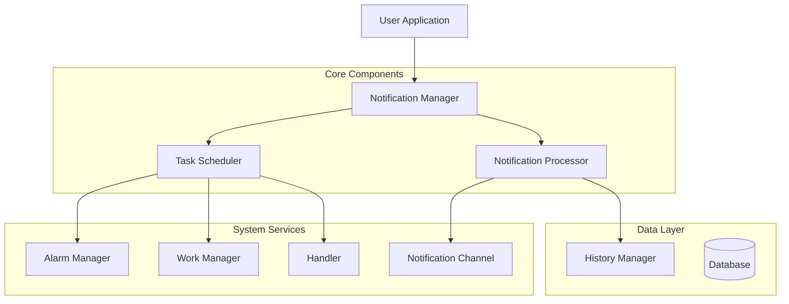

# 通用本地通知系统技术架构文档

## 1. 技术架构概述

### 1.1 架构设计



### 1.2 核心设计原则

1. **三重保障机制**：AlarmManager + WorkManager + Handler 确保任务可靠执行
2. **去重机制**：防止重复通知，确保用户体验
3. **精确时间调度**：支持毫秒级精确定时
4. **模块化设计**：松耦合，易于扩展和维护
5. **性能优化**：内存友好，电池优化

## 2. 核心组件实现

### 2.1 通知任务模型

```kotlin
/**
 * 本地通知任务数据模型
 */
data class LocalNotificationTask(
    val taskId: String,                    // 任务唯一标识
    val businessType: String,              // 业务类型
    val scheduledTime: Long,               // 计划执行时间
    val notificationType: NotificationType,  // 通知类型
    val maxExpiryTime: Long = 0,          // 最大过期时间
    val extraData: Map<String, String> = emptyMap(), // 额外数据
    val priority: Int = 0                   // 优先级
)

/**
 * 通知类型枚举
 */
enum class NotificationType {
    ALARM,      // 闹钟类型（精确时间）
    WORKER,     // 工作器类型（可延迟）
    HANDLER     // 处理器类型（短时间延迟）
}
```

### 2.2 核心管理器实现

```kotlin
/**
 * 本地通知核心管理器
 */
object LocalNotificationManager {
    
    private const val TAG = "LocalNotificationManager"
    private const val REQUEST_CODE_BASE = 10000
    
    // 系统服务
    private val context by lazy { ApplicationProvider.getApplicationContext<Context>() }
    private val notificationManager by lazy { context.getSystemService(Context.NOTIFICATION_SERVICE) as NotificationManager }
    private val alarmManager by lazy { context.getSystemService(Context.ALARM_SERVICE) as AlarmManager }
    
    // 数据访问对象
    private val historyDao by lazy { LocalNotificationHistoryDao() }
    
    /**
     * 添加本地通知任务
     */
    suspend fun addNotificationTask(task: LocalNotificationTask): Boolean = withContext(Dispatchers.IO) {
        try {
            // 1. 检查任务是否已存在
            if (isTaskExists(task.taskId)) {
                Log.w(TAG, "Task already exists: ${task.taskId}")
                return@withContext false
            }
            
            // 2. 检查任务是否已过期
            if (isTaskExpired(task)) {
                Log.w(TAG, "Task is expired: ${task.taskId}")
                return@withContext false
            }
            
            // 3. 根据通知类型调度任务
            when (task.notificationType) {
                NotificationType.ALARM -> scheduleAlarmTask(task)
                NotificationType.WORKER -> scheduleWorkerTask(task)
                NotificationType.HANDLER -> scheduleHandlerTask(task)
            }
            
            // 4. 记录任务历史
            historyDao.insertTask(task.toHistoryEntity())
            
            Log.d(TAG, "Successfully added notification task: ${task.taskId}")
            true
        } catch (e: Exception) {
            Log.e(TAG, "Failed to add notification task", e)
            false
        }
    }
    
    /**
     * 取消本地通知任务
     */
    suspend fun cancelNotificationTask(taskId: String): Boolean = withContext(Dispatchers.IO) {
        try {
            // 1. 取消 AlarmManager 任务
            val alarmIntent = createAlarmIntent(taskId)
            alarmManager.cancel(alarmIntent)
            
            // 2. 取消 WorkManager 任务
            WorkManager.getInstance(context).cancelUniqueWork(taskId)
            
            // 3. 取消 Handler 任务
            HandlerScheduler.cancel(taskId)
            
            // 4. 更新历史记录
            historyDao.updateTaskStatus(taskId, NotificationStatus.CANCELLED)
            
            Log.d(TAG, "Successfully cancelled notification task: $taskId")
            true
        } catch (e: Exception) {
            Log.e(TAG, "Failed to cancel notification task", e)
            false
        }
    }
    
    /**
     * 分发通知任务
     */
    suspend fun dispatchNotificationTask(task: LocalNotificationTask): Boolean = withContext(Dispatchers.IO) {
        try {
            // 1. 检查任务是否已执行过
            if (isTaskAlreadyExecuted(task.taskId)) {
                Log.w(TAG, "Task already executed: ${task.taskId}")
                return@withContext false
            }
            
            // 2. 检查任务是否过期
            if (isTaskExpired(task)) {
                Log.w(TAG, "Task expired during dispatch: ${task.taskId}")
                historyDao.updateTaskStatus(task.taskId, NotificationStatus.EXPIRED)
                return@withContext false
            }
            
            // 3. 处理通知
            NotificationProcessor.process(task)
            
            // 4. 更新历史记录
            historyDao.updateTaskStatus(task.taskId, NotificationStatus.COMPLETED)
            
            Log.d(TAG, "Successfully dispatched notification task: ${task.taskId}")
            true
        } catch (e: Exception) {
            Log.e(TAG, "Failed to dispatch notification task", e)
            historyDao.updateTaskStatus(task.taskId, NotificationStatus.FAILED)
            false
        }
    }
    
    /**
     * 调度 AlarmManager 任务
     */
    private fun scheduleAlarmTask(task: LocalNotificationTask) {
        val intent = createAlarmIntent(task.taskId).apply {
            putExtra("task", task)
        }
        
        val pendingIntent = PendingIntent.getBroadcast(
            context,
            task.taskId.hashCode() + REQUEST_CODE_BASE,
            intent,
            PendingIntent.FLAG_UPDATE_CURRENT or PendingIntent.FLAG_IMMUTABLE
        )
        
        if (Build.VERSION.SDK_INT >= Build.VERSION_CODES.M) {
            alarmManager.setExactAndAllowWhileIdle(AlarmManager.RTC_WAKEUP, task.scheduledTime, pendingIntent)
        } else {
            alarmManager.setExact(AlarmManager.RTC_WAKEUP, task.scheduledTime, pendingIntent)
        }
    }
    
    /**
     * 调度 WorkManager 任务
     */
    private fun scheduleWorkerTask(task: LocalNotificationTask) {
        val delay = task.scheduledTime - System.currentTimeMillis()
        
        val workRequest = OneTimeWorkRequestBuilder<NotificationWorker>()
            .setInitialDelay(delay, TimeUnit.MILLISECONDS)
            .setInputData(workDataOf("task" to Json.encodeToString(task)))
            .addTag(task.businessType)
            .build()
        
        WorkManager.getInstance(context).enqueueUniqueWork(
            task.taskId,
            ExistingWorkPolicy.REPLACE,
            workRequest
        )
    }
    
    /**
     * 调度 Handler 任务
     */
    private fun scheduleHandlerTask(task: LocalNotificationTask) {
        val delay = task.scheduledTime - System.currentTimeMillis()
        HandlerScheduler.schedule(task.taskId, delay) {
            GlobalScope.launch {
                dispatchNotificationTask(task)
            }
        }
    }
    
    private fun createAlarmIntent(taskId: String): Intent {
        return Intent(context, NotificationAlarmReceiver::class.java).apply {
            action = "com.example.notification.ALARM"
            putExtra("task_id", taskId)
        }
    }
    
    private suspend fun isTaskExists(taskId: String): Boolean {
        return historyDao.getTaskById(taskId) != null
    }
    
    private fun isTaskExpired(task: LocalNotificationTask): Boolean {
        return task.maxExpiryTime > 0 && System.currentTimeMillis() > task.maxExpiryTime
    }
    
    private suspend fun isTaskAlreadyExecuted(taskId: String): Boolean {
        val history = historyDao.getTaskById(taskId)
        return history?.status == NotificationStatus.COMPLETED
    }
}
```

### 2.3 通知处理器实现

```kotlin
/**
 * 通知处理器
 */
object NotificationProcessor {
    
    private const val TAG = "NotificationProcessor"
    private const val CHANNEL_ID = "local_notification_channel"
    private const val CHANNEL_NAME = "Local Notifications"
    
    private val context by lazy { ApplicationProvider.getApplicationContext<Context>() }
    private val notificationManager by lazy { context.getSystemService(Context.NOTIFICATION_SERVICE) as NotificationManager }
    
    /**
     * 处理通知任务
     */
    suspend fun process(task: LocalNotificationTask): Boolean = withContext(Dispatchers.IO) {
        try {
            // 1. 创建通知渠道
            createNotificationChannel()
            
            // 2. 构建通知
            val notification = buildNotification(task)
            
            // 3. 显示通知
            val notificationId = task.taskId.hashCode()
            notificationManager.notify(notificationId, notification)
            
            Log.d(TAG, "Successfully processed notification: ${task.taskId}")
            true
        } catch (e: Exception) {
            Log.e(TAG, "Failed to process notification", e)
            false
        }
    }
    
    /**
     * 创建通知渠道
     */
    private fun createNotificationChannel() {
        if (Build.VERSION.SDK_INT >= Build.VERSION_CODES.O) {
            val channel = NotificationChannel(
                CHANNEL_ID,
                CHANNEL_NAME,
                NotificationManager.IMPORTANCE_HIGH
            ).apply {
                description = "Channel for local notifications"
                enableLights(true)
                lightColor = Color.BLUE
                enableVibration(true)
                setSound(RingtoneManager.getDefaultUri(RingtoneManager.TYPE_NOTIFICATION), null)
            }
            
            notificationManager.createNotificationChannel(channel)
        }
    }
    
    /**
     * 构建通知
     */
    private fun buildNotification(task: LocalNotificationTask): Notification {
        // 创建点击意图
        val clickIntent = createClickIntent(task)
        val clickPendingIntent = PendingIntent.getActivity(
            context,
            task.taskId.hashCode(),
            clickIntent,
            PendingIntent.FLAG_UPDATE_CURRENT or PendingIntent.FLAG_IMMUTABLE
        )
        
        // 创建取消意图
        val cancelIntent = createCancelIntent(task)
        val cancelPendingIntent = PendingIntent.getBroadcast(
            context,
            task.taskId.hashCode() + 1,
            cancelIntent,
            PendingIntent.FLAG_UPDATE_CURRENT or PendingIntent.FLAG_IMMUTABLE
        )
        
        return NotificationCompat.Builder(context, CHANNEL_ID)
            .setSmallIcon(android.R.drawable.ic_dialog_info)
            .setContentTitle(task.extraData["title"] ?: "Notification")
            .setContentText(task.extraData["content"] ?: "You have a new notification")
            .setPriority(NotificationCompat.PRIORITY_HIGH)
            .setCategory(NotificationCompat.CATEGORY_REMINDER)
            .setAutoCancel(true)
            .setContentIntent(clickPendingIntent)
            .setDeleteIntent(cancelPendingIntent)
            .setDefaults(NotificationCompat.DEFAULT_ALL)
            .build()
    }
    
    private fun createClickIntent(task: LocalNotificationTask): Intent {
        return Intent(context, NotificationActivity::class.java).apply {
            putExtra("task_id", task.taskId)
            putExtra("business_type", task.businessType)
            putExtra("extra_data", HashMap(task.extraData))
            flags = Intent.FLAG_ACTIVITY_NEW_TASK or Intent.FLAG_ACTIVITY_CLEAR_TOP
        }
    }
    
    private fun createCancelIntent(task: LocalNotificationTask): Intent {
        return Intent(context, NotificationCancelReceiver::class.java).apply {
            action = "com.example.notification.CANCEL"
            putExtra("task_id", task.taskId)
        }
    }
}
```

### 2.4 Handler调度器实现

```kotlin
/**
 * Handler任务调度器
 */
object HandlerScheduler {
    
    private const val TAG = "HandlerScheduler"
    
    private val handler = Handler(Looper.getMainLooper())
    private val activeRunnables = mutableMapOf<String, Runnable>()
    
    /**
     * 调度任务
     */
    fun schedule(taskId: String, delayMillis: Long, action: () -> Unit) {
        cancel(taskId) // 取消已存在的任务
        
        val runnable = Runnable {
            synchronized(activeRunnables) {
                activeRunnables.remove(taskId)
            }
            action()
        }
        
        synchronized(activeRunnables) {
            activeRunnables[taskId] = runnable
        }
        
        handler.postDelayed(runnable, delayMillis)
        Log.d(TAG, "Scheduled handler task: $taskId, delay: $delayMillis")
    }
    
    /**
     * 取消任务
     */
    fun cancel(taskId: String) {
        synchronized(activeRunnables) {
            activeRunnables[taskId]?.let { runnable ->
                handler.removeCallbacks(runnable)
                activeRunnables.remove(taskId)
                Log.d(TAG, "Cancelled handler task: $taskId")
            }
        }
    }
    
    /**
     * 取消所有任务
     */
    fun cancelAll() {
        synchronized(activeRunnables) {
            activeRunnables.forEach { (taskId, runnable) ->
                handler.removeCallbacks(runnable)
                Log.d(TAG, "Cancelled handler task: $taskId")
            }
            activeRunnables.clear()
        }
    }
}
```

## 3. 数据存储层

### 3.1 历史记录实体

```kotlin
/**
 * 通知历史记录实体
 */
@Entity(tableName = "notification_history")
data class NotificationHistoryEntity(
    @PrimaryKey
    val taskId: String,
    
    val businessType: String,
    
    val scheduledTime: Long,
    
    val notificationType: String,
    
    val status: String, // pending, completed, cancelled, expired, failed
    
    val createTime: Long = System.currentTimeMillis(),
    
    val updateTime: Long = System.currentTimeMillis(),
    
    val extraData: String = "{}"
)

/**
 * 通知状态枚举
 */
enum class NotificationStatus {
    PENDING,    // 待执行
    COMPLETED,  // 已完成
    CANCELLED,  // 已取消
    EXPIRED,    // 已过期
    FAILED      // 执行失败
}
```

### 3.2 历史记录DAO

```kotlin
/**
 * 通知历史记录数据访问对象
 */
@Dao
interface NotificationHistoryDao {
    
    @Insert(onConflict = OnConflictStrategy.REPLACE)
    suspend fun insertTask(entity: NotificationHistoryEntity)
    
    @Query("SELECT * FROM notification_history WHERE taskId = :taskId")
    suspend fun getTaskById(taskId: String): NotificationHistoryEntity?
    
    @Query("SELECT * FROM notification_history WHERE status = :status")
    suspend fun getTasksByStatus(status: String): List<NotificationHistoryEntity>
    
    @Query("UPDATE notification_history SET status = :status, updateTime = :updateTime WHERE taskId = :taskId")
    suspend fun updateTaskStatus(taskId: String, status: String, updateTime: Long = System.currentTimeMillis())
    
    @Query("DELETE FROM notification_history WHERE taskId = :taskId")
    suspend fun deleteTask(taskId: String)
    
    @Query("DELETE FROM notification_history WHERE createTime < :timestamp")
    suspend fun deleteTasksOlderThan(timestamp: Long)
    
    @Query("SELECT COUNT(*) FROM notification_history WHERE status = 'PENDING'")
    suspend fun getPendingTaskCount(): Int
}
```

### 3.3 数据库实现

```kotlin
/**
 * 通知数据库
 */
@Database(
    entities = [NotificationHistoryEntity::class],
    version = 1,
    exportSchema = false
)
abstract class NotificationDatabase : RoomDatabase() {
    
    abstract fun notificationHistoryDao(): NotificationHistoryDao
    
    companion object {
        @Volatile
        private var INSTANCE: NotificationDatabase? = null
        
        fun getInstance(context: Context): NotificationDatabase {
            return INSTANCE ?: synchronized(this) {
                val instance = Room.databaseBuilder(
                    context.applicationContext,
                    NotificationDatabase::class.java,
                    "notification_database"
                )
                .fallbackToDestructiveMigration()
                .build()
                INSTANCE = instance
                instance
            }
        }
    }
}
```

## 4. 广播接收器实现

### 4.1 闹钟接收器

```kotlin
/**
 * 通知闹钟接收器
 */
class NotificationAlarmReceiver : BroadcastReceiver() {
    
    companion object {
        const val ACTION_NAME = "com.example.notification.ALARM"
    }
    
    override fun onReceive(context: Context, intent: Intent) {
        if (intent.action != ACTION_NAME) return
        
        val taskId = intent.getStringExtra("task_id") ?: return
        
        // 从数据库获取任务详情
        GlobalScope.launch {
            try {
                val historyDao = LocalNotificationHistoryDao()
                val history = historyDao.getTaskById(taskId)
                
                if (history != null) {
                    val task = history.toLocalNotificationTask()
                    LocalNotificationManager.dispatchNotificationTask(task)
                }
            } catch (e: Exception) {
                Log.e("NotificationAlarmReceiver", "Failed to process alarm", e)
            }
        }
    }
}
```

### 4.2 取消接收器

```kotlin
/**
 * 通知取消接收器
 */
class NotificationCancelReceiver : BroadcastReceiver() {
    
    override fun onReceive(context: Context, intent: Intent) {
        if (intent.action != "com.example.notification.CANCEL") return
        
        val taskId = intent.getStringExtra("task_id") ?: return
        
        GlobalScope.launch {
            LocalNotificationManager.cancelNotificationTask(taskId)
        }
    }
}
```

## 5. WorkManager实现

```kotlin
/**
 * 通知工作器
 */
class NotificationWorker(
    context: Context,
    workerParams: WorkerParameters
) : CoroutineWorker(context, workerParams) {
    
    companion object {
        const val TAG = "NotificationWorker"
    }
    
    override suspend fun doWork(): Result = coroutineScope {
        try {
            val taskJson = inputData.getString("task") ?: return@coroutineScope Result.failure()
            val task = Json.decodeFromString<LocalNotificationTask>(taskJson)
            
            val success = LocalNotificationManager.dispatchNotificationTask(task)
            
            if (success) {
                Result.success()
            } else {
                Result.retry()
            }
        } catch (e: Exception) {
            Log.e(TAG, "Failed to process notification worker", e)
            Result.failure()
        }
    }
}
```

## 6. 配置和初始化

### 6.1 Gradle依赖配置

```gradle
// build.gradle (Module: app)
dependencies {
    // 核心依赖
    implementation "androidx.core:core-ktx:1.12.0"
    implementation "androidx.appcompat:appcompat:1.6.1"
    
    // 通知相关
    implementation "androidx.work:work-runtime-ktx:2.9.0"
    implementation "androidx.room:room-runtime:2.6.1"
    implementation "androidx.room:room-ktx:2.6.1"
    kapt "androidx.room:room-compiler:2.6.1"
    
    // Kotlin协程
    implementation "org.jetbrains.kotlinx:kotlinx-coroutines-android:1.7.3"
    implementation "org.jetbrains.kotlinx:kotlinx-serialization-json:1.6.0"
    
    // 生命周期
    implementation "androidx.lifecycle:lifecycle-runtime-ktx:2.7.0"
    implementation "androidx.lifecycle:lifecycle-process:2.7.0"
}
```

### 6.2 AndroidManifest.xml配置

```xml
<?xml version="1.0" encoding="utf-8"?>
<manifest xmlns:android="http://schemas.android.com/apk/res/android"
    xmlns:tools="http://schemas.android.com/tools">

    <!-- 必要权限 -->
    <uses-permission android:name="android.permission.POST_NOTIFICATIONS" />
    <uses-permission android:name="android.permission.SCHEDULE_EXACT_ALARM" />
    <uses-permission android:name="android.permission.USE_EXACT_ALARM" />
    <uses-permission android:name="android.permission.RECEIVE_BOOT_COMPLETED" />
    <uses-permission android:name="android.permission.WAKE_LOCK" />

    <application
        android:name=".NotificationApplication"
        android:allowBackup="true"
        android:icon="@mipmap/ic_launcher"
        android:label="@string/app_name"
        android:theme="@style/Theme.AppCompat.Light.NoActionBar">

        <!-- 主界面 -->
        <activity
            android:name=".NotificationActivity"
            android:exported="true"
            android:launchMode="singleTop">
            <intent-filter>
                <action android:name="android.intent.action.MAIN" />
                <category android:name="android.intent.category.LAUNCHER" />
            </intent-filter>
        </activity>

        <!-- 闹钟接收器 -->
        <receiver
            android:name=".NotificationAlarmReceiver"
            android:exported="false"
            android:enabled="true">
            <intent-filter>
                <action android:name="com.example.notification.ALARM" />
            </intent-filter>
        </receiver>

        <!-- 取消接收器 -->
        <receiver
            android:name=".NotificationCancelReceiver"
            android:exported="false"
            android:enabled="true">
            <intent-filter>
                <action android:name="com.example.notification.CANCEL" />
            </intent-filter>
        </receiver>

        <!-- 启动接收器 -->
        <receiver
            android:name=".BootReceiver"
            android:exported="false"
            android:enabled="true"
            android:permission="android.permission.RECEIVE_BOOT_COMPLETED">
            <intent-filter>
                <action android:name="android.intent.action.BOOT_COMPLETED" />
                <action android:name="android.intent.action.QUICKBOOT_POWERON" />
                <category android:name="android.intent.category.DEFAULT" />
            </intent-filter>
        </receiver>

        <!-- WorkManager -->
        <provider
            android:name="androidx.work.impl.WorkManagerInitializer"
            android:authorities="${applicationId}.workmanager-init"
            android:exported="false"
            tools:node="remove" />

    </application>
</manifest>
```

### 6.3 应用初始化

```kotlin
/**
 * 通知应用类
 */
class NotificationApplication : Application() {
    
    override fun onCreate() {
        super.onCreate()
        
        // 初始化通知系统
        NotificationSystemInitializer.init(this)
    }
}

/**
 * 通知系统初始化器
 */
object NotificationSystemInitializer {
    
    fun init(context: Context) {
        // 初始化WorkManager
        val config = Configuration.Builder()
            .setMinimumLoggingLevel(Log.DEBUG)
            .build()
        WorkManager.initialize(context, config)
        
        // 重新调度未完成的任务
        GlobalScope.launch {
            reschedulePendingTasks(context)
        }
    }
    
    private suspend fun reschedulePendingTasks(context: Context) {
        try {
            val database = NotificationDatabase.getInstance(context)
            val historyDao = database.notificationHistoryDao()
            
            val pendingTasks = historyDao.getTasksByStatus(NotificationStatus.PENDING.name)
            
            pendingTasks.forEach { history ->
                val task = history.toLocalNotificationTask()
                
                // 检查任务是否已过期
                if (task.scheduledTime > System.currentTimeMillis()) {
                    LocalNotificationManager.addNotificationTask(task)
                } else {
                    historyDao.updateTaskStatus(task.taskId, NotificationStatus.EXPIRED)
                }
            }
            
            Log.d("NotificationSystemInitializer", "Rescheduled ${pendingTasks.size} pending tasks")
        } catch (e: Exception) {
            Log.e("NotificationSystemInitializer", "Failed to reschedule tasks", e)
        }
    }
}
```

## 7. 使用示例

### 7.1 基本使用

```kotlin
class MainActivity : AppCompatActivity() {
    
    override fun onCreate(savedInstanceState: Bundle?) {
        super.onCreate(savedInstanceState)
        setContentView(R.layout.activity_main)
        
        // 创建通知任务
        val task = LocalNotificationTask(
            taskId = "reminder_123",
            businessType = "reminder",
            scheduledTime = System.currentTimeMillis() + 5000, // 5秒后
            notificationType = NotificationType.ALARM,
            extraData = mapOf(
                "title" to "提醒",
                "content" to "您有一个新的提醒"
            )
        )
        
        // 添加任务
        lifecycleScope.launch {
            val success = LocalNotificationManager.addNotificationTask(task)
            if (success) {
                Toast.makeText(this@MainActivity, "通知已安排", Toast.LENGTH_SHORT).show()
            }
        }
    }
}
```

### 7.2 取消通知

```kotlin
// 取消特定通知
lifecycleScope.launch {
    LocalNotificationManager.cancelNotificationTask("reminder_123")
}
```

### 7.3 批量操作

```kotlin
// 批量添加通知任务
val tasks = listOf(
    LocalNotificationTask(
        taskId = "task_1",
        businessType = "reminder",
        scheduledTime = System.currentTimeMillis() + 10000,
        notificationType = NotificationType.WORKER,
        extraData = mapOf("title" to "提醒1", "content" to "内容1")
    ),
    LocalNotificationTask(
        taskId = "task_2",
        businessType = "reminder",
        scheduledTime = System.currentTimeMillis() + 20000,
        notificationType = NotificationType.WORKER,
        extraData = mapOf("title" to "提醒2", "content" to "内容2")
    )
)

lifecycleScope.launch {
    tasks.forEach { task ->
        LocalNotificationManager.addNotificationTask(task)
    }
}
```

## 8. 性能优化

### 8.1 内存优化

```kotlin
/**
 * 内存优化的通知管理器
 */
object OptimizedNotificationManager {
    
    private val memoryCache = LruCache<String, LocalNotificationTask>(100)
    
    suspend fun addNotificationTask(task: LocalNotificationTask): Boolean {
        // 添加到内存缓存
        memoryCache.put(task.taskId, task)
        
        // 限制并发数量
        return withContext(Dispatchers.IO.limitedParallelism(5)) {
            LocalNotificationManager.addNotificationTask(task)
        }
    }
    
    fun getCachedTask(taskId: String): LocalNotificationTask? {
        return memoryCache.get(taskId)
    }
    
    fun clearCache() {
        memoryCache.evictAll()
    }
}
```

### 8.2 电池优化

```kotlin
/**
 * 电池优化的调度策略
 */
object BatteryOptimizedScheduler {
    
    fun shouldUseAlarmManager(task: LocalNotificationTask): Boolean {
        val delay = task.scheduledTime - System.currentTimeMillis()
        
        return when {
            delay < 60_000 -> true // 1分钟内使用AlarmManager
            delay < 5 * 60_000 && isDeviceCharging() -> true // 充电状态下5分钟内
            else -> false // 其他情况使用WorkManager
        }
    }
    
    private fun isDeviceCharging(): Boolean {
        val context = ApplicationProvider.getApplicationContext<Context>()
        val batteryManager = context.getSystemService(Context.BATTERY_SERVICE) as BatteryManager
        return batteryManager.isCharging
    }
}
```

## 9. 错误处理和监控

### 9.1 错误处理

```kotlin
/**
 * 通知错误处理器
 */
object NotificationErrorHandler {
    
    private const val TAG = "NotificationErrorHandler"
    
    fun handleError(error: Throwable, task: LocalNotificationTask?) {
        when (error) {
            is SecurityException -> handleSecurityError(error)
            is IllegalStateException -> handleStateError(error)
            is IOException -> handleIOError(error)
            else -> handleGenericError(error, task)
        }
    }
    
    private fun handleSecurityError(error: SecurityException) {
        Log.e(TAG, "Security error - missing permissions", error)
        // 记录到分析系统
        Analytics.logEvent("notification_security_error", error.message ?: "Unknown")
    }
    
    private fun handleStateError(error: IllegalStateException) {
        Log.e(TAG, "State error - invalid system state", error)
        // 尝试恢复
        GlobalScope.launch {
            delay(1000)
            // 重试逻辑
        }
    }
    
    private fun handleIOError(error: IOException) {
        Log.e(TAG, "IO error - database or file system issue", error)
        // 清理缓存
        OptimizedNotificationManager.clearCache()
    }
    
    private fun handleGenericError(error: Throwable, task: LocalNotificationTask?) {
        Log.e(TAG, "Generic error processing notification", error)
        task?.let {
            // 更新任务状态
            GlobalScope.launch {
                LocalNotificationHistoryDao().updateTaskStatus(
                    it.taskId, 
                    NotificationStatus.FAILED
                )
            }
        }
    }
}
```

### 9.2 性能监控

```kotlin
/**
 * 通知性能监控器
 */
object NotificationPerformanceMonitor {
    
    private const val TAG = "NotificationPerformanceMonitor"
    
    data class PerformanceMetrics(
        val taskId: String,
        val startTime: Long,
        var endTime: Long = 0,
        var memoryUsage: Long = 0,
        var batteryLevel: Int = 0
    )
    
    private val activeMetrics = mutableMapOf<String, PerformanceMetrics>()
    
    fun startMonitoring(taskId: String) {
        val metrics = PerformanceMetrics(
            taskId = taskId,
            startTime = System.currentTimeMillis(),
            memoryUsage = getCurrentMemoryUsage(),
            batteryLevel = getCurrentBatteryLevel()
        )
        
        activeMetrics[taskId] = metrics
    }
    
    fun endMonitoring(taskId: String) {
        activeMetrics[taskId]?.let { metrics ->
            metrics.endTime = System.currentTimeMillis()
            
            val duration = metrics.endTime - metrics.startTime
            val memoryDelta = getCurrentMemoryUsage() - metrics.memoryUsage
            
            Log.d(TAG, "Task $taskId performance - Duration: ${duration}ms, Memory delta: $memoryDelta")
            
            // 记录性能数据
            Analytics.logEvent("notification_performance", mapOf(
                "task_id" to taskId,
                "duration" to duration,
                "memory_delta" to memoryDelta,
                "battery_level" to metrics.batteryLevel
            ))
            
            activeMetrics.remove(taskId)
        }
    }
    
    private fun getCurrentMemoryUsage(): Long {
        val runtime = Runtime.getRuntime()
        return runtime.totalMemory() - runtime.freeMemory()
    }
    
    private fun getCurrentBatteryLevel(): Int {
        val context = ApplicationProvider.getApplicationContext<Context>()
        val batteryManager = context.getSystemService(Context.BATTERY_SERVICE) as BatteryManager
        return batteryManager.getIntProperty(BatteryManager.BATTERY_PROPERTY_CAPACITY)
    }
}
```

## 10. 测试

### 10.1 单元测试

```kotlin
/**
 * 通知管理器单元测试
 */
@RunWith(AndroidJUnit4::class)
class LocalNotificationManagerTest {
    
    @get:Rule
    val instantTaskExecutorRule = InstantTaskExecutorRule()
    
    private lateinit var context: Context
    private lateinit var notificationManager: LocalNotificationManager
    
    @Before
    fun setup() {
        context = ApplicationProvider.getApplicationContext()
        notificationManager = LocalNotificationManager
    }
    
    @Test
    fun testAddNotificationTask() = runTest {
        val task = LocalNotificationTask(
            taskId = "test_123",
            businessType = "test",
            scheduledTime = System.currentTimeMillis() + 1000,
            notificationType = NotificationType.ALARM,
            extraData = mapOf("title" to "Test", "content" to "Test content")
        )
        
        val result = notificationManager.addNotificationTask(task)
        assertTrue(result)
    }
    
    @Test
    fun testCancelNotificationTask() = runTest {
        val taskId = "test_cancel_123"
        
        // 先添加任务
        val task = LocalNotificationTask(
            taskId = taskId,
            businessType = "test",
            scheduledTime = System.currentTimeMillis() + 10000,
            notificationType = NotificationType.WORKER
        )
        
        notificationManager.addNotificationTask(task)
        
        // 取消任务
        val result = notificationManager.cancelNotificationTask(taskId)
        assertTrue(result)
    }
    
    @Test
    fun testDuplicateTaskPrevention() = runTest {
        val taskId = "duplicate_test"
        
        val task = LocalNotificationTask(
            taskId = taskId,
            businessType = "test",
            scheduledTime = System.currentTimeMillis() + 5000,
            notificationType = NotificationType.ALARM
        )
        
        // 第一次添加应该成功
        val result1 = notificationManager.addNotificationTask(task)
        assertTrue(result1)
        
        // 第二次添加应该失败（重复任务）
        val result2 = notificationManager.addNotificationTask(task)
        assertFalse(result2)
    }
}
```

### 10.2 集成测试

```kotlin
/**
 * 通知系统集成测试
 */
@RunWith(AndroidJUnit4::class)
class NotificationIntegrationTest {
    
    @get:Rule
    val activityRule = ActivityScenarioRule(TestActivity::class.java)
    
    @Test
    fun testEndToEndNotificationFlow() = runTest {
        val task = LocalNotificationTask(
            taskId = "integration_test_123",
            businessType = "test",
            scheduledTime = System.currentTimeMillis() + 2000, // 2秒后执行
            notificationType = NotificationType.HANDLER,
            extraData = mapOf(
                "title" to "Integration Test",
                "content" to "This is an integration test notification"
            )
        )
        
        // 添加任务
        val addResult = LocalNotificationManager.addNotificationTask(task)
        assertTrue("Failed to add notification task", addResult)
        
        // 等待任务执行
        delay(3000)
        
        // 验证通知是否显示
        val notificationManager = ApplicationProvider.getApplicationContext<Context>()
            .getSystemService(Context.NOTIFICATION_SERVICE) as NotificationManager
        
        val activeNotifications = notificationManager.activeNotifications
        val foundNotification = activeNotifications.any { notification ->
            notification.id == task.taskId.hashCode()
        }
        
        assertTrue("Notification was not displayed", foundNotification)
    }
}
```

## 11. 常见问题和解决方案

### 11.1 权限问题

```kotlin
/**
 * 权限管理器
 */
object NotificationPermissionManager {
    
    fun checkRequiredPermissions(context: Context): List<String> {
        val missingPermissions = mutableListOf<String>()
        
        // 检查通知权限
        if (Build.VERSION.SDK_INT >= Build.VERSION_CODES.TIRAMISU) {
            if (ContextCompat.checkSelfPermission(context, Manifest.permission.POST_NOTIFICATIONS) 
                != PackageManager.PERMISSION_GRANTED) {
                missingPermissions.add(Manifest.permission.POST_NOTIFICATIONS)
            }
        }
        
        // 检查精确闹钟权限
        if (Build.VERSION.SDK_INT >= Build.VERSION_CODES.S) {
            if (!context.getSystemService(AlarmManager::class.java).canScheduleExactAlarms()) {
                // 需要引导用户到设置页面开启权限
            }
        }
        
        return missingPermissions
    }
    
    fun requestPermissions(activity: Activity, permissions: List<String>) {
        if (permissions.isNotEmpty()) {
            ActivityCompat.requestPermissions(
                activity,
                permissions.toTypedArray(),
                1001
            )
        }
    }
}
```

### 11.2 电池优化问题

```kotlin
/**
 * 电池优化管理器
 */
object BatteryOptimizationManager {
    
    fun isIgnoringBatteryOptimizations(context: Context): Boolean {
        if (Build.VERSION.SDK_INT >= Build.VERSION_CODES.M) {
            val powerManager = context.getSystemService(Context.POWER_SERVICE) as PowerManager
            return powerManager.isIgnoringBatteryOptimizations(context.packageName)
        }
        return true
    }
    
    fun requestIgnoreBatteryOptimizations(activity: Activity) {
        if (Build.VERSION.SDK_INT >= Build.VERSION_CODES.M) {
            val intent = Intent(Settings.ACTION_REQUEST_IGNORE_BATTERY_OPTIMIZATIONS).apply {
                data = Uri.parse("package:${activity.packageName}")
            }
            activity.startActivity(intent)
        }
    }
}
```

### 11.3 内存泄漏防护

```kotlin
/**
 * 内存泄漏防护
 */
object MemoryLeakPrevention {
    
    private val compositeDisposable = CompositeDisposable()
    
    fun setupCleanup(context: Context) {
        // 监听应用生命周期
        ProcessLifecycleOwner.get().lifecycle.addObserver(object : DefaultLifecycleObserver {
            override fun onStop(owner: LifecycleOwner) {
                // 应用进入后台，清理不必要的资源
                cleanupResources()
            }
            
            override fun onDestroy(owner: LifecycleOwner) {
                // 应用销毁，清理所有资源
                compositeDisposable.clear()
                HandlerScheduler.cancelAll()
                OptimizedNotificationManager.clearCache()
            }
        })
    }
    
    private fun cleanupResources() {
        // 清理过期任务
        GlobalScope.launch {
            val dao = LocalNotificationHistoryDao()
            val expiredTime = System.currentTimeMillis() - 24 * 60 * 60 * 1000 // 24小时前
            dao.deleteTasksOlderThan(expiredTime)
        }
        
        // 清理内存缓存
        OptimizedNotificationManager.clearCache()
    }
}
```

## 12. 总结

这份通用本地通知系统技术文档提供了完整的实现方案，包括：

1. **核心架构**：基于三重保障机制的可靠通知系统
2. **完整代码**：所有核心组件的完整实现代码
3. **配置指南**：详细的集成和配置步骤
4. **性能优化**：内存和电池使用优化
5. **错误处理**：完善的异常处理和监控机制
6. **测试方案**：单元测试和集成测试示例
7. **常见问题**：实际开发中可能遇到的问题和解决方案

该系统具有以下特点：
- **高可靠性**：多重保障确保通知准确送达
- **高性能**：优化的资源使用和内存管理
- **易扩展**：模块化设计便于功能扩展
- **易维护**：完善的日志和监控体系
- **通用性**：完全剥离业务逻辑，适用于任何Android项目

开发者可以直接使用这份文档中的代码和配置，快速集成到自己的项目中，构建稳定可靠的本地通知功能。