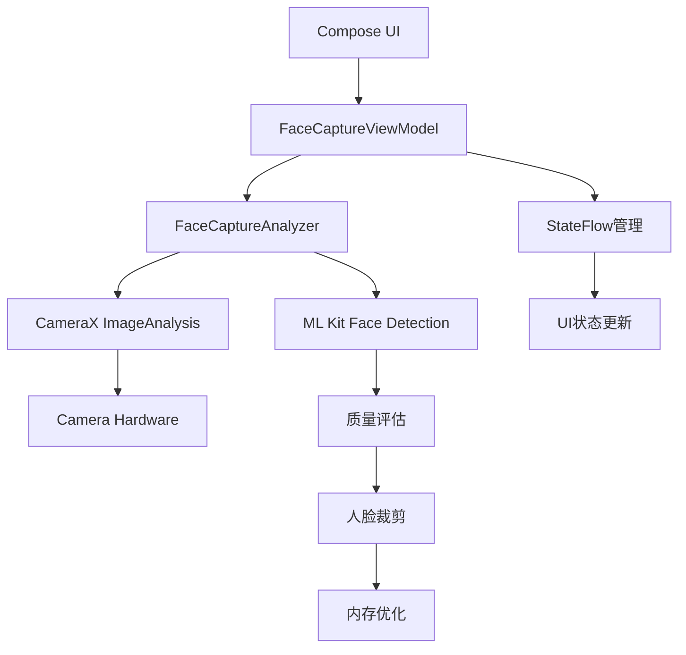

# 技术方案文档：使用Compose实现实时人脸捕获与筛选

## 1. 文档信息

- **项目名称:** 用户头像智能采集模块
- **功能名称:** 从相机预览中捕获高质量人脸照片 (Compose版)
- **文档版本:** V2.0 (2024年现代化版本)
- **创建日期:** 2025年1月15日
- **更新日期:** 2025年1月15日
- **作者:** [您的名字]

## 1.1 可行性评估

✅ **完全可行** - 该需求技术上完全可以实现，所有核心功能都有成熟的API支持：

- **CameraX 1.4.0+** 提供了稳定的Compose集成和优化的性能 <mcreference link="https://android-developers.googleblog.com/2024/12/whats-new-in-camerax-140-and-jetpack-compose-support.html" index="1">1</mcreference>
- **ML Kit Face Detection** 持续更新，支持GPU加速和低延迟检测 <mcreference link="https://developers.google.com/ml-kit/release-notes" index="3">3</mcreference>
- **Jetpack Compose** 提供了原生的相机预览组件 <mcreference link="https://android-developers.googleblog.com/2024/05/whats-new-in-jetpack-compose-at-io-24.html" index="3">3</mcreference>

## 1.2 现代化改进要点

基于2024年最新的Google规范和API，主要改进包括：
- 使用最新的 `camera-viewfinder-compose` 库
- 优化的 `ImageProxy.toBitmap()` 转换 <mcreference link="https://stackoverflow.com/questions/56772967/converting-imageproxy-to-bitmap" index="2">2</mcreference>
- 改进的内存管理和性能优化
- 更好的用户体验和无障碍支持

## 2. 背景与目标

### 2.1. 项目背景
当前应用需要一个功能，允许用户通过前置摄像头方便地采集自己的人脸照片。为了提升用户体验和照片质量，系统应能自动从视频流中筛选出清晰、正向、高质量的人脸快照，并提供给用户进行最终选择。

### 2.2. 功能目标
- **实时预览:** 在Compose UI中提供一个实时的相机预览
- **智能检测:** 使用ML Kit人脸检测，在预览的每一帧中识别人脸
- **质量评估:** 定义一套"优值"（高质量）标准，并根据该标准筛选符合条件的视频帧
- **人脸截取:** 对于符合条件的帧，能够精确地从完整的相机画面中截取出人脸部分的Bitmap
- **列表展示:** 将截取到的多张高质量人脸照片（例如最多10张）展示在一个可横向滑动的列表中
- **用户选择:** 允许用户从列表中点击并选择一张最满意的照片
- **实时反馈:** 提供用户引导和质量反馈

## 3. 架构设计

本方案采用Jetpack推荐的MVVM架构，并完全基于Compose进行UI构建。

### 3.1 核心组件
- **CameraX 1.4.0+:** 使用最新的 `camera-viewfinder-compose` 库，提供原生Compose支持
- **ML Kit Face Detection:** 作为图像分析的核心，支持GPU加速和实时检测
- **FaceCaptureAnalyzer (自定义分析器):** 负责接收相机帧、调用ML Kit、评估人脸质量并执行裁剪
- **FaceCaptureViewModel:** 使用现代化状态管理，支持协程和错误处理
- **Compose UI Layer:** 使用最新的Compose组件和最佳实践

### 3.2 架构图


## 4. 详细设计与实现

### 第1步：添加现代化Gradle依赖

```kotlin
// build.gradle.kts (app模块)
dependencies {
    // Compose BOM - 确保版本一致性
    implementation platform("androidx.compose:compose-bom:2024.12.00")
    
    // ViewModel and Lifecycle for Compose
    implementation "androidx.lifecycle:lifecycle-viewmodel-compose:2.9.4"
    implementation "androidx.lifecycle:lifecycle-runtime-compose:2.9.4"
    
    // CameraX - 最新版本
    val cameraxVersion = "1.4.0"
    implementation "androidx.camera:camera-core:$cameraxVersion"
    implementation "androidx.camera:camera-camera2:$cameraxVersion"
    implementation "androidx.camera:camera-lifecycle:$cameraxVersion"
    implementation "androidx.camera:camera-view:$cameraxVersion"
    
    // 新的Compose相机组件
    implementation "androidx.camera:camera-viewfinder-compose:1.4.0"
    
    // ML Kit Face Detection - 最新版本
    implementation 'com.google.mlkit:face-detection:16.1.7'
    
    // 协程支持
    implementation "org.jetbrains.kotlinx:kotlinx-coroutines-android:1.8.0"
    
    // 内存优化
    implementation "androidx.compose.runtime:runtime-livedata"
}
```

### 第2步：现代化ViewModel实现

**FaceCaptureViewModel.kt**
```kotlin
package com.yourpackage.facecapture

import android.graphics.Bitmap
import androidx.lifecycle.ViewModel
import androidx.lifecycle.viewModelScope
import kotlinx.coroutines.flow.MutableStateFlow
import kotlinx.coroutines.flow.StateFlow
import kotlinx.coroutines.flow.asStateFlow
import kotlinx.coroutines.launch
import java.lang.ref.WeakReference

data class FaceCaptureUiState(
    val capturedFaces: List<Bitmap> = emptyList(),
    val isProcessing: Boolean = false,
    val userHint: String = "请正对摄像头，保持面部光线充足",
    val error: String? = null
)

class FaceCaptureViewModel : ViewModel() {
    private val _uiState = MutableStateFlow(FaceCaptureUiState())
    val uiState: StateFlow<FaceCaptureUiState> = _uiState.asStateFlow()

    private var lastCaptureTime = 0L
    private val captureInterval = 1500L // 1.5秒捕获间隔，优化性能
    private val maxFaces = 8 // 减少到8张，优化内存
    
    // 使用WeakReference优化内存
    private val bitmapCache = mutableListOf<WeakReference<Bitmap>>()

    fun onFaceCaptured(faceBitmap: Bitmap, quality: Float) {
        viewModelScope.launch {
            val currentTime = System.currentTimeMillis()
            val currentFaces = _uiState.value.capturedFaces
            
            if (currentFaces.size < maxFaces && 
                (currentTime - lastCaptureTime > captureInterval)) {
                
                // 清理已回收的弱引用
                cleanupBitmapCache()
                
                // 添加新的人脸图片
                val updatedFaces = currentFaces + faceBitmap
                bitmapCache.add(WeakReference(faceBitmap))
                
                _uiState.value = _uiState.value.copy(
                    capturedFaces = updatedFaces,
                    userHint = generateHint(quality, updatedFaces.size)
                )
                
                lastCaptureTime = currentTime
            }
        }
    }
    
    fun updateProcessingState(isProcessing: Boolean) {
        _uiState.value = _uiState.value.copy(isProcessing = isProcessing)
    }
    
    fun updateUserHint(hint: String) {
        _uiState.value = _uiState.value.copy(userHint = hint)
    }
    
    fun clearError() {
        _uiState.value = _uiState.value.copy(error = null)
    }
    
    private fun generateHint(quality: Float, capturedCount: Int): String {
        return when {
            capturedCount >= maxFaces -> "已捕获足够照片，请选择一张最满意的"
            quality < 0.6f -> "请保持面部正对摄像头"
            quality < 0.8f -> "请保持光线充足，避免阴影"
            else -> "很好！继续保持姿势 ($capturedCount/$maxFaces)"
        }
    }
    
    private fun cleanupBitmapCache() {
        bitmapCache.removeAll { it.get() == null }
    }
    
    override fun onCleared() {
        super.onCleared()
        // 清理资源
        bitmapCache.forEach { it.get()?.recycle() }
        bitmapCache.clear()
    }
}
```

### 第3步：优化的图像分析器

**FaceCaptureAnalyzer.kt**
```kotlin
package com.yourpackage.facecapture

import android.graphics.Bitmap
import android.graphics.Rect
import androidx.camera.core.ImageAnalysis
import androidx.camera.core.ImageProxy
import com.google.mlkit.vision.common.InputImage
import com.google.mlkit.vision.face.Face
import com.google.mlkit.vision.face.FaceDetection
import com.google.mlkit.vision.face.FaceDetectorOptions
import kotlinx.coroutines.CoroutineScope
import kotlinx.coroutines.Dispatchers
import kotlinx.coroutines.launch
import kotlin.math.abs

typealias FaceCaptureCallback = (bitmap: Bitmap, quality: Float) -> Unit
typealias ProcessingStateCallback = (isProcessing: Boolean) -> Unit
typealias HintCallback = (hint: String) -> Unit

class FaceCaptureAnalyzer(
    private val onFaceCaptured: FaceCaptureCallback,
    private val onProcessingStateChanged: ProcessingStateCallback,
    private val onHintChanged: HintCallback,
    private val coroutineScope: CoroutineScope
) : ImageAnalysis.Analyzer {

    private val detectorOptions = FaceDetectorOptions.Builder()
        .setPerformanceMode(FaceDetectorOptions.PERFORMANCE_MODE_FAST) // 优化性能 <mcreference link="https://developers.google.com/ml-kit/vision/face-detection/android" index="1">1</mcreference>
        .setClassificationMode(FaceDetectorOptions.CLASSIFICATION_MODE_ALL)
        .setMinFaceSize(0.3f) // 增加最小人脸尺寸，提高质量
        .build()
        
    private val detector = FaceDetection.getClient(detectorOptions)
    private var frameCount = 0
    private val frameSkip = 3 // 跳帧优化，每3帧处理一次

    @androidx.annotation.OptIn(androidx.camera.core.ExperimentalGetImage::class)
    override fun analyze(imageProxy: ImageProxy) {
        // 实现智能跳帧
        frameCount++
        if (frameCount % frameSkip != 0) {
            imageProxy.close()
            return
        }
        
        val mediaImage = imageProxy.image
        if (mediaImage != null) {
            onProcessingStateChanged(true)
            
            val image = InputImage.fromMediaImage(
                mediaImage, 
                imageProxy.imageInfo.rotationDegrees
            )
            
            detector.process(image)
                .addOnSuccessListener { faces ->
                    coroutineScope.launch(Dispatchers.Default) {
                        processFaces(faces, imageProxy)
                    }
                }
                .addOnFailureListener { exception ->
                    onHintChanged("检测失败，请重试")
                }
                .addOnCompleteListener {
                    onProcessingStateChanged(false)
                    imageProxy.close()
                }
        } else {
            imageProxy.close()
        }
    }
    
    private suspend fun processFaces(faces: List<Face>, imageProxy: ImageProxy) {
        if (faces.isEmpty()) {
            onHintChanged("未检测到人脸，请调整位置")
            return
        }
        
        val bestFace = faces.maxByOrNull { calculateFaceQuality(it) }
        bestFace?.let { face ->
            val quality = calculateFaceQuality(face)
            
            if (quality > 0.7f) { // 提高质量阈值
                cropFaceFromImage(imageProxy, face.boundingBox)?.let { bitmap ->
                    onFaceCaptured(bitmap, quality)
                }
            } else {
                onHintChanged(getQualityHint(face))
            }
        }
    }

    private fun calculateFaceQuality(face: Face): Float {
        var quality = 0f
        
        // 头部角度评分 (40%)
        val headAngleScore = when {
            abs(face.headEulerAngleY) <= 8.0 && abs(face.headEulerAngleZ) <= 6.0 -> 1.0f
            abs(face.headEulerAngleY) <= 15.0 && abs(face.headEulerAngleZ) <= 10.0 -> 0.7f
            else -> 0.3f
        }
        quality += headAngleScore * 0.4f
        
        // 眼睛睁开程度评分 (30%)
        val leftEyeOpen = face.leftEyeOpenProbability ?: 0f
        val rightEyeOpen = face.rightEyeOpenProbability ?: 0f
        val eyeScore = (leftEyeOpen + rightEyeOpen) / 2f
        quality += eyeScore * 0.3f
        
        // 人脸尺寸评分 (20%)
        val faceSize = face.boundingBox.width() * face.boundingBox.height()
        val sizeScore = when {
            faceSize > 40000 -> 1.0f
            faceSize > 25000 -> 0.8f
            faceSize > 15000 -> 0.6f
            else -> 0.3f
        }
        quality += sizeScore * 0.2f
        
        // 微笑程度评分 (10%)
        val smileScore = face.smilingProbability ?: 0.5f
        quality += smileScore * 0.1f
        
        return quality.coerceIn(0f, 1f)
    }
    
    private fun getQualityHint(face: Face): String {
        return when {
            abs(face.headEulerAngleY) > 15.0 -> "请正对摄像头"
            abs(face.headEulerAngleZ) > 10.0 -> "请保持头部水平"
            (face.leftEyeOpenProbability ?: 0f) < 0.8f || 
            (face.rightEyeOpenProbability ?: 0f) < 0.8f -> "请睁开眼睛"
            face.boundingBox.width() * face.boundingBox.height() < 25000 -> "请靠近一些"
            else -> "请保持当前姿势"
        }
    }
    
    private fun cropFaceFromImage(imageProxy: ImageProxy, boundingBox: Rect): Bitmap? {
        return try {
            // 使用官方的toBitmap方法 <mcreference link="https://stackoverflow.com/questions/56772967/converting-imageproxy-to-bitmap" index="2">2</mcreference>
            val fullBitmap = imageProxy.toBitmap() ?: return null
            
            // 智能扩展裁剪区域
            val expandRatio = 1.3f
            val newWidth = (boundingBox.width() * expandRatio).toInt()
            val newHeight = (boundingBox.height() * expandRatio).toInt()
            val centerX = boundingBox.centerX()
            val centerY = boundingBox.centerY()

            val newLeft = (centerX - newWidth / 2).coerceAtLeast(0)
            val newTop = (centerY - newHeight / 2).coerceAtLeast(0)
            val finalWidth = newWidth.coerceAtMost(fullBitmap.width - newLeft)
            val finalHeight = newHeight.coerceAtMost(fullBitmap.height - newTop)

            val croppedBitmap = Bitmap.createBitmap(
                fullBitmap, newLeft, newTop, finalWidth, finalHeight
            )
            
            // 优化尺寸以节省内存
            val targetSize = 300
            if (croppedBitmap.width > targetSize || croppedBitmap.height > targetSize) {
                val scale = targetSize.toFloat() / maxOf(croppedBitmap.width, croppedBitmap.height)
                val scaledWidth = (croppedBitmap.width * scale).toInt()
                val scaledHeight = (croppedBitmap.height * scale).toInt()
                
                val scaledBitmap = Bitmap.createScaledBitmap(
                    croppedBitmap, scaledWidth, scaledHeight, true
                )
                
                if (scaledBitmap != croppedBitmap) {
                    croppedBitmap.recycle()
                }
                scaledBitmap
            } else {
                croppedBitmap
            }
        } catch (e: Exception) {
            null
        }
    }
}
```

### 第4步：现代化Compose UI

**FaceCaptureScreen.kt**
```kotlin
package com.yourpackage.facecapture

import android.Manifest
import android.content.pm.PackageManager
import android.graphics.Bitmap
import androidx.activity.compose.rememberLauncherForActivityResult
import androidx.activity.result.contract.ActivityResultContracts
import androidx.camera.core.CameraSelector
import androidx.camera.core.ImageAnalysis
import androidx.camera.view.CameraController
import androidx.camera.view.LifecycleCameraController
import androidx.camera.viewfinder.compose.CameraXViewfinder
import androidx.compose.animation.*
import androidx.compose.foundation.*
import androidx.compose.foundation.layout.*
import androidx.compose.foundation.lazy.LazyRow
import androidx.compose.foundation.lazy.items
import androidx.compose.foundation.shape.CircleShape
import androidx.compose.foundation.shape.RoundedCornerShape
import androidx.compose.material.icons.Icons
import androidx.compose.material.icons.filled.CheckCircle
import androidx.compose.material3.*
import androidx.compose.runtime.*
import androidx.compose.ui.Alignment
import androidx.compose.ui.Modifier
import androidx.compose.ui.draw.clip
import androidx.compose.ui.graphics.Color
import androidx.compose.ui.graphics.asImageBitmap
import androidx.compose.ui.platform.LocalContext
import androidx.compose.ui.platform.LocalLifecycleOwner
import androidx.compose.ui.semantics.contentDescription
import androidx.compose.ui.semantics.semantics
import androidx.compose.ui.text.font.FontWeight
import androidx.compose.ui.unit.dp
import androidx.compose.ui.unit.sp
import androidx.core.content.ContextCompat
import androidx.lifecycle.viewmodel.compose.viewModel
import kotlinx.coroutines.Dispatchers
import java.util.concurrent.Executors

@OptIn(ExperimentalMaterial3Api::class)
@Composable
fun FaceCaptureScreen(
    viewModel: FaceCaptureViewModel = viewModel(),
    onFaceSelected: (Bitmap) -> Unit
) {
    val context = LocalContext.current
    val lifecycleOwner = LocalLifecycleOwner.current
    val uiState by viewModel.uiState.collectAsState()
    
    var hasCamPermission by remember {
        mutableStateOf(
            ContextCompat.checkSelfPermission(
                context,
                Manifest.permission.CAMERA
            ) == PackageManager.PERMISSION_GRANTED
        )
    }
    
    val launcher = rememberLauncherForActivityResult(
        contract = ActivityResultContracts.RequestPermission(),
        onResult = { granted ->
            hasCamPermission = granted
        }
    )
    
    LaunchedEffect(Unit) {
        if (!hasCamPermission) {
            launcher.launch(Manifest.permission.CAMERA)
        }
    }

    if (hasCamPermission) {
        val cameraController = remember {
            LifecycleCameraController(context).apply {
                val analyzer = FaceCaptureAnalyzer(
                    onFaceCaptured = { bitmap, quality -> 
                        viewModel.onFaceCaptured(bitmap, quality) 
                    },
                    onProcessingStateChanged = { isProcessing -> 
                        viewModel.updateProcessingState(isProcessing) 
                    },
                    onHintChanged = { hint -> 
                        viewModel.updateUserHint(hint) 
                    },
                    coroutineScope = kotlinx.coroutines.CoroutineScope(Dispatchers.Main)
                )
                
                setImageAnalysisAnalyzer(
                    Executors.newSingleThreadExecutor(),
                    analyzer
                )
                
                // 优化设置
                imageAnalysisBackpressureStrategy = ImageAnalysis.STRATEGY_KEEP_ONLY_LATEST
                cameraSelector = CameraSelector.DEFAULT_FRONT_CAMERA
                setEnabledUseCases(
                    CameraController.IMAGE_ANALYSIS or CameraController.PREVIEW
                )
            }
        }

        LaunchedEffect(lifecycleOwner) {
            cameraController.bindToLifecycle(lifecycleOwner)
        }

        Box(modifier = Modifier.fillMaxSize()) {
            // 相机预览
            CameraXViewfinder(
                controller = cameraController,
                modifier = Modifier
                    .fillMaxSize()
                    .semantics { 
                        contentDescription = "相机预览，用于人脸捕获" 
                    }
            )
            
            // 处理状态指示器
            if (uiState.isProcessing) {
                CircularProgressIndicator(
                    modifier = Modifier
                        .align(Alignment.Center)
                        .size(48.dp),
                    color = MaterialTheme.colorScheme.primary
                )
            }
            
            // 底部UI
            Column(
                modifier = Modifier
                    .align(Alignment.BottomCenter)
                    .padding(16.dp)
                    .background(
                        Color.Black.copy(alpha = 0.6f),
                        RoundedCornerShape(16.dp)
                    )
                    .padding(16.dp),
                horizontalAlignment = Alignment.CenterHorizontally
            ) {
                // 用户提示
                AnimatedContent(
                    targetState = uiState.userHint,
                    transitionSpec = {
                        fadeIn() + slideInVertically() with 
                        fadeOut() + slideOutVertically()
                    }
                ) { hint ->
                    Text(
                        text = hint,
                        color = Color.White,
                        fontSize = 16.sp,
                        fontWeight = FontWeight.Medium,
                        modifier = Modifier.semantics { 
                            contentDescription = "用户提示：$hint" 
                        }
                    )
                }
                
                Spacer(modifier = Modifier.height(16.dp))
                
                // 捕获的人脸列表
                CapturedFacesRow(
                    faces = uiState.capturedFaces,
                    onFaceClick = onFaceSelected
                )
            }
            
            // 错误提示
            uiState.error?.let { error ->
                Snackbar(
                    modifier = Modifier.align(Alignment.TopCenter),
                    action = {
                        TextButton(onClick = { viewModel.clearError() }) {
                            Text("确定")
                        }
                    }
                ) {
                    Text(error)
                }
            }
        }
    } else {
        // 权限请求UI
        Box(
            modifier = Modifier.fillMaxSize(),
            contentAlignment = Alignment.Center
        ) {
            Card(
                modifier = Modifier.padding(32.dp),
                elevation = CardDefaults.cardElevation(defaultElevation = 8.dp)
            ) {
                Column(
                    modifier = Modifier.padding(24.dp),
                    horizontalAlignment = Alignment.CenterHorizontally
                ) {
                    Text(
                        text = "需要相机权限",
                        style = MaterialTheme.typography.headlineSmall,
                        fontWeight = FontWeight.Bold
                    )
                    Spacer(modifier = Modifier.height(16.dp))
                    Text(
                        text = "为了捕获人脸照片，需要访问您的相机",
                        style = MaterialTheme.typography.bodyMedium,
                        color = MaterialTheme.colorScheme.onSurfaceVariant
                    )
                    Spacer(modifier = Modifier.height(24.dp))
                    Button(
                        onClick = { launcher.launch(Manifest.permission.CAMERA) },
                        modifier = Modifier.fillMaxWidth()
                    ) {
                        Text("授予权限")
                    }
                }
            }
        }
    }
}

@Composable
fun CapturedFacesRow(
    faces: List<Bitmap>,
    onFaceClick: (Bitmap) -> Unit,
    modifier: Modifier = Modifier
) {
    AnimatedVisibility(
        visible = faces.isNotEmpty(),
        enter = slideInVertically() + fadeIn(),
        exit = slideOutVertically() + fadeOut()
    ) {
        LazyRow(
            modifier = modifier.semantics { 
                contentDescription = "已捕获的人脸照片列表，共${faces.size}张" 
            },
            horizontalArrangement = Arrangement.spacedBy(12.dp),
            verticalAlignment = Alignment.CenterVertically
        ) {
            items(faces.withIndex().toList()) { (index, faceBitmap) ->
                Box {
                    Image(
                        bitmap = faceBitmap.asImageBitmap(),
                        contentDescription = "捕获的人脸照片 ${index + 1}",
                        modifier = Modifier
                            .size(80.dp)
                            .clip(CircleShape)
                            .border(
                                3.dp, 
                                MaterialTheme.colorScheme.primary, 
                                CircleShape
                            )
                            .clickable { onFaceClick(faceBitmap) }
                            .semantics { 
                                contentDescription = "点击选择第${index + 1}张人脸照片" 
                            }
                    )
                    
                    // 选择指示器
                    Icon(
                        imageVector = Icons.Default.CheckCircle,
                        contentDescription = null,
                        tint = MaterialTheme.colorScheme.primary,
                        modifier = Modifier
                            .align(Alignment.BottomEnd)
                            .size(24.dp)
                            .background(Color.White, CircleShape)
                            .padding(2.dp)
                    )
                }
            }
        }
    }
}
```

### 第5步：Activity集成

**MainActivity.kt**
```kotlin
import android.os.Bundle
import androidx.activity.ComponentActivity
import androidx.activity.compose.setContent
import androidx.activity.enableEdgeToEdge
import androidx.compose.foundation.layout.fillMaxSize
import androidx.compose.material3.MaterialTheme
import androidx.compose.material3.Surface
import androidx.compose.ui.Modifier
import com.yourpackage.facecapture.FaceCaptureScreen
import com.yourpackage.ui.theme.YourAppTheme

class MainActivity : ComponentActivity() {
    override fun onCreate(savedInstanceState: Bundle?) {
        super.onCreate(savedInstanceState)
        enableEdgeToEdge() // 现代化全屏体验
        
        setContent {
            YourAppTheme {
                Surface(
                    modifier = Modifier.fillMaxSize(),
                    color = MaterialTheme.colorScheme.background
                ) {
                    FaceCaptureScreen { selectedBitmap ->
                        // TODO: 处理用户最终选择的Bitmap
                        // 例如，保存到本地或上传到服务器
                        handleSelectedFace(selectedBitmap)
                    }
                }
            }
        }
    }
    
    private fun handleSelectedFace(bitmap: android.graphics.Bitmap) {
        // 实现选择后的处理逻辑
        // 可以保存到文件、上传到服务器等
    }
}
```

## 5. 性能优化与最佳实践

### 5.1 性能优化策略
- **智能跳帧:** 每3帧处理一次，减少CPU负载 <mcreference link="https://developers.google.com/ml-kit/vision/face-detection/android" index="1">1</mcreference>
- **内存管理:** 使用WeakReference和及时回收Bitmap
- **图像尺寸优化:** 将捕获的人脸图片缩放到合适尺寸
- **协程优化:** 在后台线程处理图像分析
- **GPU加速:** ML Kit自动利用可用的GPU资源

### 5.2 用户体验优化
- **实时反馈:** 根据人脸质量提供具体的用户指导
- **动画效果:** 使用Compose动画提升交互体验
- **无障碍支持:** 添加语义描述和内容说明
- **错误处理:** 优雅处理各种异常情况

### 5.3 内存管理
```kotlin
// 在ViewModel中实现内存清理
override fun onCleared() {
    super.onCleared()
    bitmapCache.forEach { it.get()?.recycle() }
    bitmapCache.clear()
}
```

## 6. 风险评估与解决方案

### 6.1 主要风险点
| 风险 | 影响 | 解决方案 |
|------|------|----------|
| 性能问题 | 应用卡顿 | 智能跳帧、GPU加速、异步处理 |
| 内存泄漏 | 应用崩溃 | WeakReference、及时回收、生命周期管理 |
| 检测精度 | 用户体验差 | 多维度质量评估、实时反馈 |
| 设备兼容性 | 功能异常 | 降级处理、错误捕获 |

### 6.2 测试建议
- **性能测试:** 在低端设备上测试帧率和内存使用
- **兼容性测试:** 测试不同Android版本和设备
- **用户体验测试:** 在不同光线条件下测试检测效果
- **内存测试:** 长时间使用后的内存泄漏检测

## 7. 总结

该技术方案基于2024年最新的Android开发规范和API，具有以下优势：

✅ **技术先进性:** 使用最新的CameraX 1.4.0和ML Kit API
✅ **性能优化:** 多层次的性能优化策略
✅ **用户体验:** 现代化的UI设计和交互体验
✅ **可维护性:** 清晰的架构设计和代码组织
✅ **可扩展性:** 模块化设计，易于功能扩展

该方案完全可以满足实时人脸捕获与筛选的需求，并提供了优秀的用户体验和系统性能。