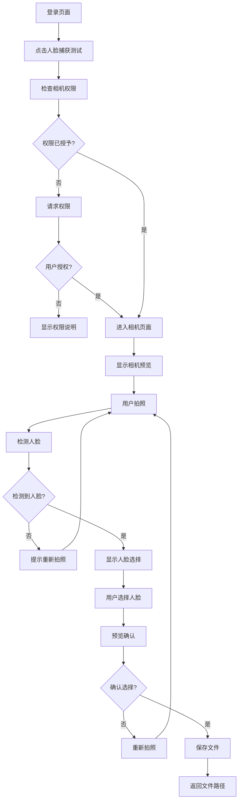

# 手动人脸捕获功能产品需求文档

## 1. 产品概述

手动人脸捕获功能是对现有动态人脸捕获方案的重要改进，旨在解决当前方案照片质量不高、模糊等问题。新方案采用手动拍照模式，用户可以主动控制拍照时机，然后从拍照结果中智能提取高质量的人脸照片。

该功能主要解决用户在人脸识别场景中对照片质量的高要求，通过手动控制和AI智能提取相结合的方式，确保获得清晰、高质量的人脸照片。目标是提升用户体验，提高人脸识别的准确率和成功率。

## 2. 核心功能

### 2.1 用户角色

本功能不需要区分用户角色，所有用户均可使用相同的功能。

### 2.2 功能模块

手动人脸捕获功能包含以下主要页面：

1. **相机拍照页面**：提供相机预览、手动拍照、实时指导功能
2. **人脸确认页面**：展示检测到的人脸、支持选择和预览、提供确认或重拍选项
3. **测试入口页面**：在登录页面添加测试按钮，方便开发和测试

### 2.3 页面详情

| 页面名称 | 模块名称 | 功能描述 |
|----------|----------|----------|
| 相机拍照页面 | 相机预览模块 | 显示实时相机画面，支持前置摄像头预览 |
| 相机拍照页面 | 拍照按钮模块 | 提供大尺寸拍照按钮，支持点击拍照 |
| 相机拍照页面 | 指导提示模块 | 显示拍照指导信息，如"请将人脸置于画面中央" |
| 相机拍照页面 | 权限管理模块 | 处理相机权限请求和权限被拒绝的情况 |
| 人脸确认页面 | 人脸检测模块 | 使用ML Kit自动检测拍照结果中的人脸 |
| 人脸确认页面 | 人脸展示模块 | 以网格或列表形式展示所有检测到的人脸 |
| 人脸确认页面 | 人脸选择模块 | 支持点击选择人脸，显示选中状态 |
| 人脸确认页面 | 人脸预览模块 | 支持放大预览选中的人脸照片 |
| 人脸确认页面 | 操作按钮模块 | 提供确认选择、重新拍照、取消操作按钮 |
| 人脸确认页面 | 文件保存模块 | 将选中的人脸保存到本地文件系统 |
| 登录页面 | 测试按钮模块 | 添加"人脸捕获测试"按钮，跳转到人脸捕获功能 |

## 3. 核心流程

### 3.1 主要用户操作流程

**标准用户流程：**
1. 用户从登录页面点击"人脸捕获测试"按钮进入功能
2. 系统检查相机权限，如无权限则请求用户授权
3. 用户看到相机预览界面，根据提示调整人脸位置
4. 用户点击拍照按钮进行拍照
5. 系统自动检测拍照结果中的人脸
6. 如检测到人脸，显示人脸选择界面；如未检测到，提示重新拍照
7. 用户从检测到的人脸中选择一个满意的人脸
8. 用户可以预览选中的人脸，确认质量
9. 用户点击确认按钮，系统保存人脸到本地文件
10. 系统返回文件路径给上一个页面，完成流程

**错误处理流程：**
- 相机权限被拒绝：显示权限说明，提供重新申请选项
- 拍照失败：显示错误提示，允许重新拍照
- 未检测到人脸：显示友好提示，引导用户重新拍照
- 文件保存失败：显示错误信息，允许重试

## 4. 用户界面设计

### 4.1 设计风格

**主要设计元素：**
- 主色调：使用应用主题色（蓝色系）
- 辅助色：白色背景，灰色文字
- 按钮样式：圆角矩形，Material Design 3风格
- 字体：系统默认字体，标题16sp，正文14sp，提示12sp
- 布局风格：简洁现代，卡片式设计
- 图标风格：Material Icons，线性风格

### 4.2 页面设计概览

| 页面名称 | 模块名称 | UI元素 |
|----------|----------|--------|
| 相机拍照页面 | 顶部导航栏 | 标题"人脸拍照"，返回按钮，深色半透明背景 |
| 相机拍照页面 | 相机预览区域 | 全屏相机预览，前置摄像头，实时画面 |
| 相机拍照页面 | 指导提示区域 | 居中显示，白色文字，半透明黑色背景，圆角卡片 |
| 相机拍照页面 | 拍照按钮 | 底部居中，72dp圆形按钮，白色半透明背景，相机图标 |
| 人脸确认页面 | 顶部导航栏 | 标题"选择人脸"，返回按钮，重拍按钮 |
| 人脸确认页面 | 原图预览区域 | 顶部显示拍摄的原始照片，可缩放查看 |
| 人脸确认页面 | 人脸网格区域 | 网格布局展示检测到的人脸，3列布局，圆角边框 |
| 人脸确认页面 | 选中状态指示 | 蓝色边框高亮，右上角勾选图标 |
| 人脸确认页面 | 底部操作栏 | 确认按钮（蓝色），重拍按钮（灰色），取消按钮 |
| 人脸确认页面 | 预览弹窗 | 全屏预览选中人脸，支持手势缩放，关闭按钮 |

### 4.3 响应式设计

**适配策略：**
- 主要针对手机竖屏使用，强制竖屏显示
- 支持不同屏幕尺寸的手机设备
- 相机预览区域自适应屏幕比例
- 按钮和文字大小适配不同DPI
- 考虑刘海屏和水滴屏的适配

**交互优化：**
- 支持触摸操作，按钮有点击反馈
- 人脸选择支持单击选中，双击预览
- 预览模式支持手势缩放和拖拽
- 提供震动反馈增强用户体验

## 5. 技术要求

### 5.1 性能要求

- 相机预览启动时间 < 2秒
- 拍照响应时间 < 1秒
- 人脸检测处理时间 < 3秒
- 文件保存时间 < 1秒
- 内存使用控制在合理范围，避免OOM

### 5.2 质量要求

- 支持检测多个人脸（最多5个）
- 人脸检测准确率 > 95%
- 保存的人脸图片分辨率 ≥ 512x512
- 图片质量清晰，无明显模糊
- 支持不同光照条件下的拍照

### 5.3 兼容性要求

- 支持Android 7.0+（API Level 24+）
- 支持主流Android设备
- 兼容不同品牌的相机硬件
- 适配不同屏幕尺寸和分辨率

### 5.4 安全要求

- 相机权限安全管理
- 本地文件安全存储
- 用户隐私保护
- 临时文件及时清理

## 6. 验收标准

### 6.1 功能验收

- ✅ 相机预览正常显示
- ✅ 拍照功能正常工作
- ✅ 人脸检测准确有效
- ✅ 人脸选择交互流畅
- ✅ 文件保存成功
- ✅ 错误处理完善

### 6.2 性能验收

- ✅ 启动速度符合要求
- ✅ 内存使用合理
- ✅ 电池消耗可接受
- ✅ 发热控制良好

### 6.3 用户体验验收

- ✅ 界面美观易用
- ✅ 操作流程顺畅
- ✅ 提示信息清晰
- ✅ 错误处理友好

### 6.4 测试验收

- ✅ 单元测试覆盖率 > 80%
- ✅ 集成测试通过
- ✅ UI测试通过
- ✅ 兼容性测试通过

## 7. 项目里程碑

### 7.1 开发阶段

**第一阶段（基础功能）：**
- 创建ManualFaceCaptureScreen基础界面
- 实现相机预览和拍照功能
- 集成ML Kit人脸检测
- 完成基本的人脸提取逻辑

**第二阶段（交互完善）：**
- 实现人脸选择和确认界面
- 添加文件保存功能
- 完善错误处理和用户提示
- 优化用户交互体验

**第三阶段（测试优化）：**
- 添加登录页面测试入口
- 性能优化和内存管理
- 全面测试和bug修复
- 文档完善和代码审查

### 7.2 测试阶段

- 功能测试：验证所有功能正常工作
- 性能测试：验证性能指标达标
- 兼容性测试：验证设备兼容性
- 用户体验测试：验证交互流畅性

### 7.3 发布准备

- 代码审查和质量检查
- 文档更新和维护指南
- 部署配置和环境准备
- 用户培训和使用指南