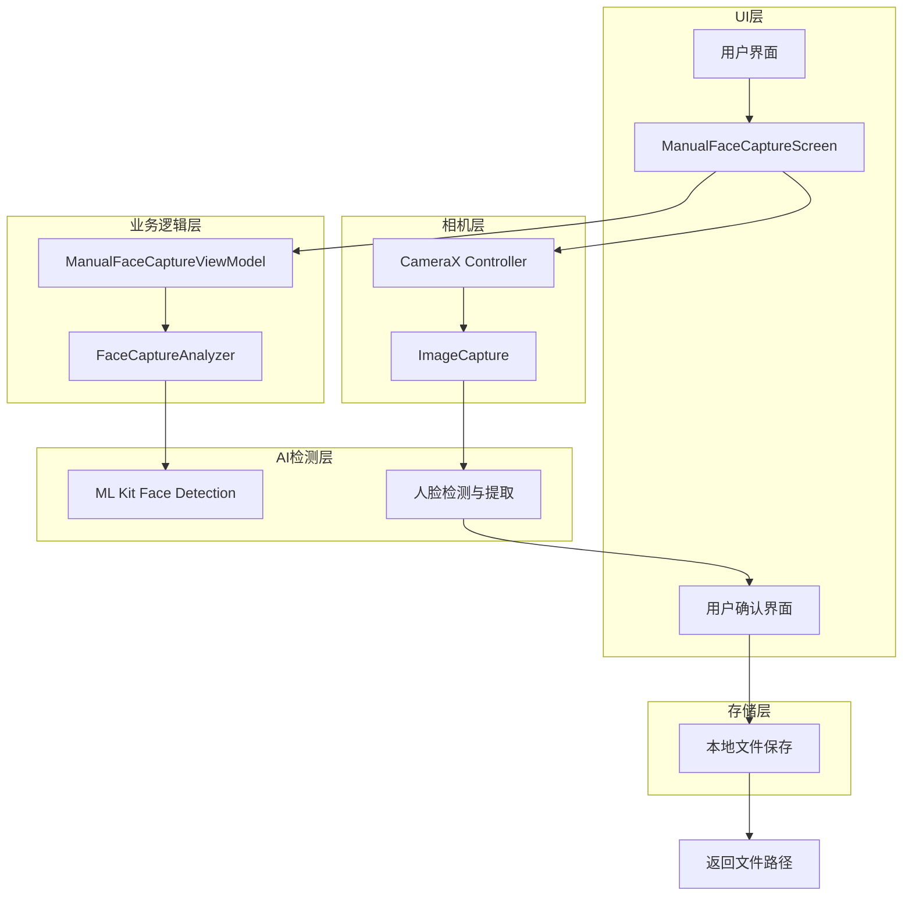
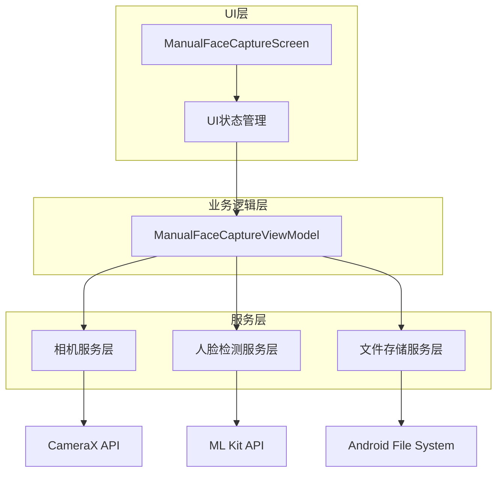
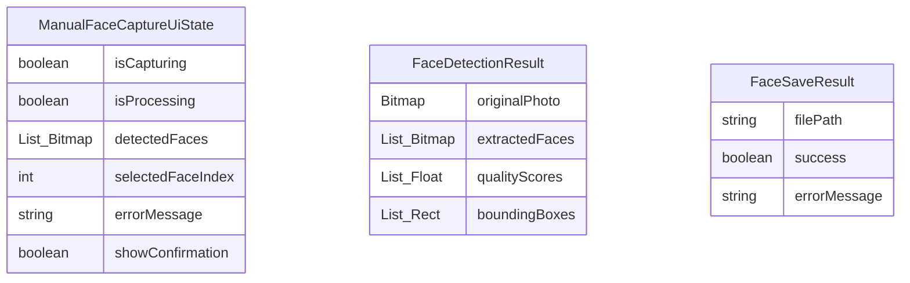
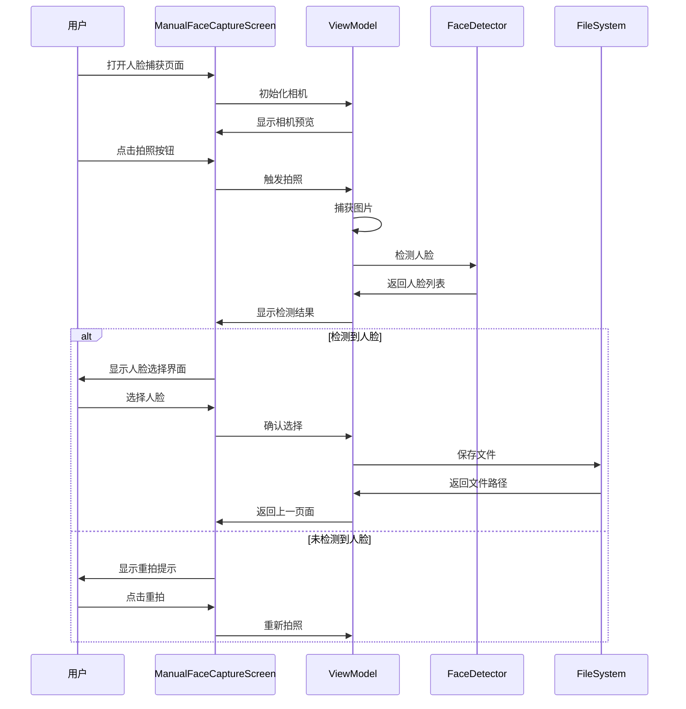
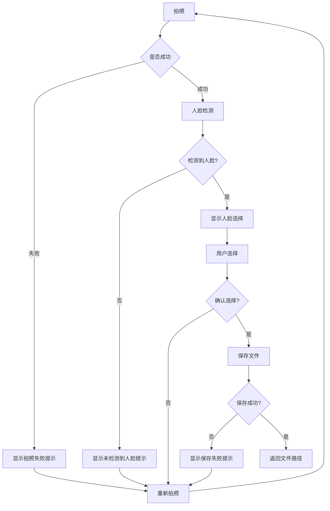

# 手动人脸捕获方案技术架构文档

## 1. 架构设计



## 2. 技术描述

- Frontend: Jetpack Compose + CameraX + ML Kit
- 相机控制: LifecycleCameraController
- 人脸检测: ML Kit Face Detection API
- 图像处理: Android Bitmap + Canvas
- 状态管理: StateFlow + ViewModel
- 文件存储: Android File System

## 3. 路由定义

| 路由 | 目的 |
|------|------|
| /manual-face-capture | 手动人脸捕获主页面，包含相机预览和拍照功能 |
| /face-confirmation | 人脸确认页面，显示检测到的人脸供用户选择 |

## 4. API定义

### 4.1 核心接口

**人脸捕获回调**
```kotlin
typealias FaceCaptureCallback = (bitmap: Bitmap, quality: Float) -> Unit
typealias FaceConfirmationCallback = (filePath: String) -> Unit
typealias FaceRetakeCallback = () -> Unit
```

**ManualFaceCaptureViewModel 主要方法**
```kotlin
// 拍照并检测人脸
suspend fun capturePhotoAndDetectFaces(): List<Bitmap>

// 保存选中的人脸到本地
suspend fun saveFaceToLocal(bitmap: Bitmap): String

// 重新拍照
fun retakePhoto()
```

**请求参数**
| 参数名 | 参数类型 | 是否必需 | 描述 |
|--------|----------|----------|------|
| onFaceSelected | (String) -> Unit | true | 人脸选择完成回调，返回文件路径 |
| onNavigateBack | () -> Unit | true | 返回导航回调 |

**响应参数**
| 参数名 | 参数类型 | 描述 |
|--------|----------|------|
| filePath | String | 保存的人脸图片文件路径 |
| success | Boolean | 操作是否成功 |

## 5. 服务架构图



## 6. 数据模型

### 6.1 数据模型定义



### 6.2 数据定义

**ManualFaceCaptureUiState.kt**
```kotlin
data class ManualFaceCaptureUiState(
    val isCapturing: Boolean = false,
    val isProcessing: Boolean = false,
    val detectedFaces: List<Bitmap> = emptyList(),
    val selectedFaceIndex: Int = -1,
    val errorMessage: String? = null,
    val showConfirmation: Boolean = false,
    val originalPhoto: Bitmap? = null
) {
    val hasDetectedFaces: Boolean get() = detectedFaces.isNotEmpty()
    val hasSelectedFace: Boolean get() = selectedFaceIndex >= 0 && selectedFaceIndex < detectedFaces.size
    val selectedFace: Bitmap? get() = if (hasSelectedFace) detectedFaces[selectedFaceIndex] else null
}
```

**FaceDetectionResult.kt**
```kotlin
data class FaceDetectionResult(
    val originalPhoto: Bitmap,
    val extractedFaces: List<Bitmap>,
    val qualityScores: List<Float>,
    val boundingBoxes: List<Rect>
) {
    val bestFaceIndex: Int get() = qualityScores.indices.maxByOrNull { qualityScores[it] } ?: -1
    val bestFace: Bitmap? get() = if (bestFaceIndex >= 0) extractedFaces[bestFaceIndex] else null
}
```

## 7. 核心组件设计

### 7.1 ManualFaceCaptureScreen.kt

**主要功能：**
- 相机预览界面
- 拍照按钮
- 人脸检测结果展示
- 用户确认/重拍操作

**关键特性：**
- 使用CameraX的LifecycleCameraController
- 集成ML Kit人脸检测
- 支持多人脸检测和选择
- 实时预览和拍照功能

### 7.2 ManualFaceCaptureViewModel.kt

**主要职责：**
- 管理UI状态
- 处理拍照逻辑
- 调用人脸检测
- 文件保存管理

**核心方法：**
```kotlin
class ManualFaceCaptureViewModel @Inject constructor(
    private val context: Context
) : ViewModel() {
    
    private val _uiState = MutableStateFlow(ManualFaceCaptureUiState())
    val uiState = _uiState.asStateFlow()
    
    suspend fun capturePhotoAndDetectFaces(imageProxy: ImageProxy): FaceDetectionResult
    suspend fun saveFaceToLocal(bitmap: Bitmap): String
    fun selectFace(index: Int)
    fun retakePhoto()
    fun confirmSelection(): String?
}
```

### 7.3 人脸检测集成

**复用现有FaceCaptureAnalyzer：**
- 使用已有的ML Kit人脸检测逻辑
- 复用人脸质量评估算法
- 复用人脸裁剪和优化功能

**新增静态图片检测：**
```kotlin
class StaticImageFaceDetector {
    suspend fun detectFacesFromBitmap(bitmap: Bitmap): List<Face>
    suspend fun extractFacesFromBitmap(bitmap: Bitmap, faces: List<Face>): List<Bitmap>
}
```

## 8. 用户交互流程

### 8.1 主要用户流程



### 8.2 错误处理流程



## 9. 性能优化策略

### 9.1 内存管理
- 及时回收Bitmap对象
- 使用WeakReference避免内存泄漏
- 限制同时处理的图片数量

### 9.2 图像处理优化
- 压缩图片尺寸到合适大小（512x512）
- 使用高效的图像格式（JPEG）
- 异步处理人脸检测任务

### 9.3 用户体验优化
- 添加加载指示器
- 提供实时反馈
- 支持手势操作（缩放、拖拽）

## 10. 测试策略

### 10.1 单元测试
- ViewModel逻辑测试
- 人脸检测算法测试
- 文件保存功能测试

### 10.2 集成测试
- 相机功能集成测试
- ML Kit集成测试
- 端到端流程测试

### 10.3 UI测试
- 用户交互测试
- 界面响应测试
- 错误场景测试

## 11. 部署和配置

### 11.1 依赖配置
```kotlin
// build.gradle (Module: app)
dependencies {
    // CameraX
    implementation "androidx.camera:camera-camera2:1.4.0"
    implementation "androidx.camera:camera-lifecycle:1.4.0"
    implementation "androidx.camera:camera-view:1.4.0"
    
    // ML Kit
    implementation 'com.google.mlkit:face-detection:16.1.6'
    
    // Compose
    implementation "androidx.compose.ui:ui:$compose_version"
    implementation "androidx.compose.material3:material3:$material3_version"
}
```

### 11.2 权限配置
```xml
<!-- AndroidManifest.xml -->
<uses-permission android:name="android.permission.CAMERA" />
<uses-permission android:name="android.permission.WRITE_EXTERNAL_STORAGE" />
```

### 11.3 ProGuard配置
```proguard
# ML Kit
-keep class com.google.mlkit.** { *; }
-keep class com.google.android.gms.** { *; }

# CameraX
-keep class androidx.camera.** { *; }
```