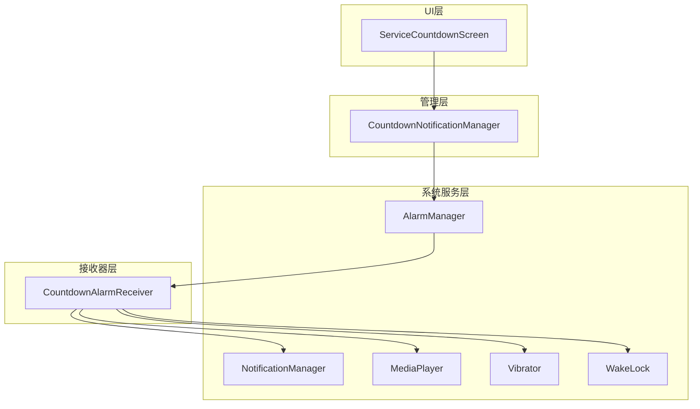
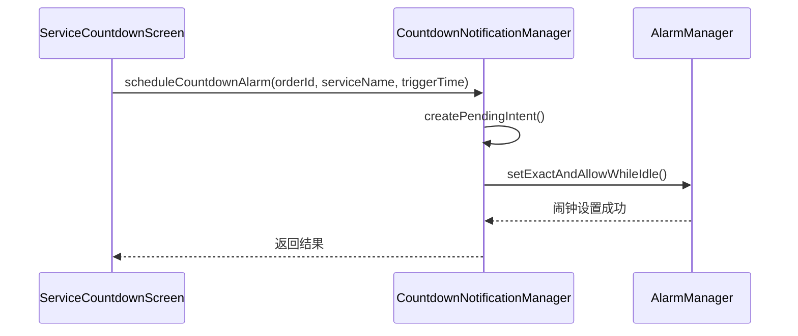
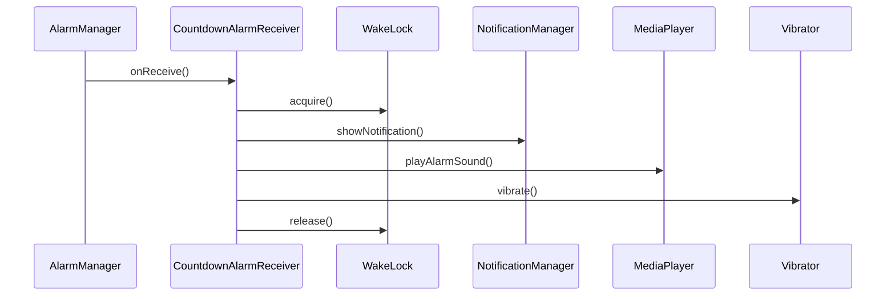

# 倒计时完成通知方案技术文档

## 1. 方案概述

### 1.1 背景与目标

本方案旨在解决Android应用中倒计时完成时的通知问题，特别是在锁屏和后台情况下的可靠性。通过使用系统级的`AlarmManager`服务，确保用户能够准时收到服务时间提醒。

### 1.2 核心特性

* **系统级可靠性**：使用`AlarmManager`确保在应用被杀死或系统休眠时仍能触发

* **锁屏支持**：通过`WakeLock`和高优先级通知在锁屏状态下唤醒设备

* **多重提醒**：结合通知、响铃和震动提供全方位提醒

* **时间精确**：使用`setExactAndAllowWhileIdle`确保准时触发

* **资源管理**：自动清理闹钟和释放系统资源

### 1.3 技术架构



## 2. 核心组件详细说明

### 2.1 CountdownNotificationManager

**职责**：管理倒计时闹钟的设置、取消和通知显示

**核心方法**：

* `scheduleCountdownAlarm()`: 设置倒计时完成闹钟

* `cancelCountdownAlarm()`: 取消已设置的闹钟

* `showCountdownCompletionNotification()`: 显示完成通知

* `createNotificationChannel()`: 创建通知渠道

* `calculateCompletionTime()`: 计算完成时间

**关键特性**：

* 使用`@Singleton`确保全局唯一实例

* 支持Android 6.0+的`setExactAndAllowWhileIdle`

* 自动创建高优先级通知渠道

* 完善的异常处理和日志记录

### 2.2 CountdownAlarmReceiver

**职责**：处理闹钟触发事件，执行通知、响铃和震动

**核心功能**：

* 获取`WakeLock`唤醒设备

* 显示高优先级通知

* 播放系统闹钟铃声

* 执行设备震动（短震-停顿-长震模式）

* 处理静音模式和无铃声情况

**兼容性处理**：

* Android版本差异的震动API适配

* 音频焦点管理

* 权限检查和异常处理

### 2.3 ServiceCountdownScreen集成

**集成点**：

* 页面启动时设置闹钟

* 页面销毁时取消闹钟

* 服务结束时清理闹钟

**实现方式**：

```kotlin
// 页面启动时
val completionTime = countdownNotificationManager.calculateCompletionTime(totalDurationMillis)
countdownNotificationManager.scheduleCountdownAlarm(orderId, serviceName, completionTime)

// 页面销毁时
DisposableEffect(Unit) {
    onDispose {
        countdownNotificationManager.cancelCountdownAlarm()
    }
}
```

## 3. 实现流程和时序图

### 3.1 设置闹钟流程



### 3.2 闹钟触发流程



## 4. 权限配置和AndroidManifest.xml设置

### 4.1 必需权限

```xml
<!-- 震动权限 -->
<uses-permission android:name="android.permission.VIBRATE" />

<!-- 唤醒锁权限 -->
<uses-permission android:name="android.permission.WAKE_LOCK" />

<!-- 精确闹钟权限 (Android 12+) -->
<uses-permission android:name="android.permission.SCHEDULE_EXACT_ALARM" />
<uses-permission android:name="android.permission.USE_EXACT_ALARM" />

<!-- 通知权限 (Android 13+) -->
<uses-permission android:name="android.permission.POST_NOTIFICATIONS" />
```

### 4.2 组件注册

```xml
<!-- 广播接收器注册 -->
<receiver
    android:name=".features.countdown.receiver.CountdownAlarmReceiver"
    android:enabled="true"
    android:exported="false" />
```

### 4.3 权限检查代码

```kotlin
// 检查精确闹钟权限
fun canScheduleExactAlarms(): Boolean {
    return if (Build.VERSION.SDK_INT >= Build.VERSION_CODES.S) {
        alarmManager.canScheduleExactAlarms()
    } else {
        true
    }
}
```

## 5. 测试方法和验证步骤

### 5.1 基础功能测试

**测试步骤**：

1. 启动服务倒计时页面
2. 设置较短的倒计时时间（如30秒）
3. 等待倒计时完成
4. 验证通知、响铃和震动是否正常

**预期结果**：

* 收到高优先级通知

* 播放系统闹钟铃声

* 设备震动（短震-停顿-长震）

### 5.2 锁屏状态测试

**测试步骤**：

1. 启动倒计时后立即锁屏
2. 等待倒计时完成
3. 观察锁屏界面是否显示通知
4. 验证设备是否被唤醒

**预期结果**：

* 锁屏界面显示通知

* 设备屏幕被唤醒

* 响铃和震动正常工作

### 5.3 后台状态测试

**测试步骤**：

1. 启动倒计时
2. 切换到其他应用或返回桌面
3. 等待倒计时完成
4. 验证通知是否正常显示

**预期结果**：

* 通知正常显示在状态栏

* 响铃和震动正常工作

* 点击通知可以返回应用

### 5.4 应用被杀死测试

**测试步骤**：

1. 启动倒计时
2. 在系统设置中强制停止应用
3. 等待倒计时完成
4. 验证通知是否仍能触发

**预期结果**：

* 即使应用被杀死，通知仍能正常触发

* 响铃和震动正常工作

### 5.5 取消闹钟测试

**测试步骤**：

1. 启动倒计时
2. 在倒计时完成前退出页面或结束服务
3. 等待原定的倒计时完成时间
4. 验证是否没有收到通知

**预期结果**：

* 不应收到任何通知

* 系统资源被正确释放

## 6. 常见问题和调试指南

### 6.1 通知不显示

**可能原因**：

* 通知权限未授予

* 通知渠道被用户禁用

* 应用通知被系统屏蔽

**解决方案**：

```kotlin
// 检查通知权限
if (Build.VERSION.SDK_INT >= Build.VERSION_CODES.TIRAMISU) {
    if (ContextCompat.checkSelfPermission(context, Manifest.permission.POST_NOTIFICATIONS) 
        != PackageManager.PERMISSION_GRANTED) {
        // 请求通知权限
    }
}

// 检查通知渠道状态
val channel = notificationManager.getNotificationChannel(COUNTDOWN_NOTIFICATION_CHANNEL_ID)
if (channel?.importance == NotificationManager.IMPORTANCE_NONE) {
    // 引导用户开启通知
}
```

### 6.2 闹钟不触发

**可能原因**：

* 精确闹钟权限未授予（Android 12+）

* 系统省电模式限制

* 应用被加入电池优化白名单

**解决方案**：

```kotlin
// 检查精确闹钟权限
if (!countdownNotificationManager.canScheduleExactAlarms()) {
    // 引导用户授予权限
    val intent = Intent(Settings.ACTION_REQUEST_SCHEDULE_EXACT_ALARM)
    startActivity(intent)
}

// 检查电池优化
val powerManager = getSystemService(Context.POWER_SERVICE) as PowerManager
if (!powerManager.isIgnoringBatteryOptimizations(packageName)) {
    // 引导用户关闭电池优化
}
```

### 6.3 响铃无声音

**可能原因**：

* 设备处于静音模式

* 系统闹钟铃声未设置

* 音频焦点被其他应用占用

**解决方案**：

```kotlin
// 检查铃声设置
val alarmUri = RingtoneManager.getDefaultUri(RingtoneManager.TYPE_ALARM)
if (alarmUri == null) {
    // 使用备用铃声或通知音
    val notificationUri = RingtoneManager.getDefaultUri(RingtoneManager.TYPE_NOTIFICATION)
    // 播放备用铃声
}

// 处理静音模式
val audioManager = getSystemService(Context.AUDIO_SERVICE) as AudioManager
if (audioManager.ringerMode == AudioManager.RINGER_MODE_SILENT) {
    // 只震动，不播放声音
}
```

### 6.4 调试日志

**关键日志点**：

```kotlin
// CountdownNotificationManager
logI("倒计时闹钟已设置: orderId=$orderId, triggerTime=$triggerTimeMillis")
logE("设置倒计时闹钟失败: ${e.message}")

// CountdownAlarmReceiver
logI("倒计时闹钟触发: orderId=$orderId, serviceName=$serviceName")
logE("播放闹钟铃声失败: ${e.message}")
```

**调试命令**：

```bash
# 查看闹钟设置
adb shell dumpsys alarm | grep com.ytone.longcare

# 查看通知状态
adb shell dumpsys notification

# 模拟闹钟触发
adb shell am broadcast -a android.intent.action.BOOT_COMPLETED
```

## 7. 性能优化建议

### 7.1 内存优化

* **及时释放WakeLock**：确保在处理完成后立即释放

* \*\*避

