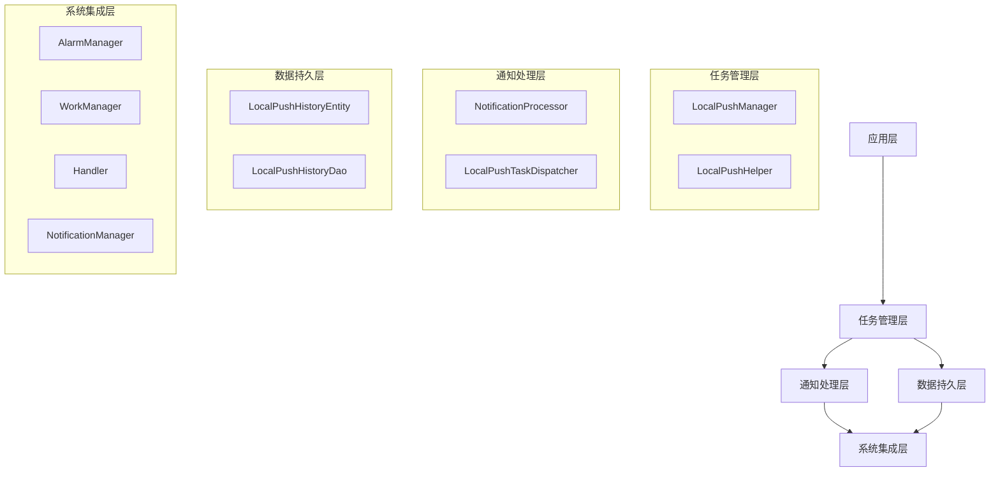
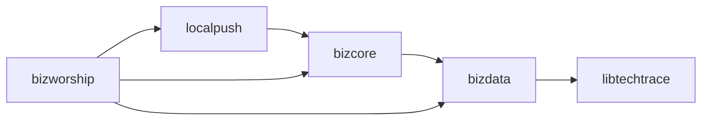

# 本地通知技术架构文档

## 1. 技术架构概述

### 1.1 整体架构设计

本地通知系统采用分层架构设计，核心组件包括：
- **任务管理层**：负责任务的创建、调度、取消
- **通知处理层**：处理不同类型的通知展示
- **数据持久层**：管理通知历史和配置
- **系统集成层**：与Android系统服务集成



### 1.2 核心设计模式

1. **单例模式**：核心管理器类使用单例确保全局一致性
2. **策略模式**：不同类型的通知使用不同的处理器
3. **观察者模式**：监听应用生命周期和系统事件
4. **工厂模式**：创建不同类型的本地推送任务

### 1.3 模块依赖关系



## 2. 核心组件技术实现

### 2.1 LocalPushManager - 本地推送管理器

#### 核心功能
- 任务创建、调度、取消
- 三重保障机制（AlarmManager + WorkManager + Handler）
- 去重处理
- 历史记录管理

#### 技术实现

```kotlin
object LocalPushManager {
    
    // 任务类型常量
    const val PUSH_TYPE_ALL = "all"
    const val PUSH_TYPE_ALARM = "alarm"
    const val PUSH_TYPE_WORKER = "worker"
    const val PUSH_TYPE_HANDLER = "handler"
    
    /**
     * 添加本地推送任务
     * 支持多种调度方式：AlarmManager、WorkManager、Handler
     */
    suspend fun addLocalPushTask(
        context: Context,
        task: LocalPushTask,
        duplicateCheck: Boolean = true
    ): Boolean = withContext(Dispatchers.IO) {
        
        // 1. 去重检查
        if (duplicateCheck && isDuplicateTask(task)) {
            return@withContext false
        }
        
        // 2. 根据任务类型选择调度方式
        when (task.pushType) {
            PUSH_TYPE_ALARM -> scheduleAlarmTask(context, task)
            PUSH_TYPE_WORKER -> scheduleWorkerTask(context, task)
            PUSH_TYPE_HANDLER -> scheduleHandlerTask(task)
            PUSH_TYPE_ALL -> scheduleAllTypes(context, task)
            else -> scheduleAllTypes(context, task)
        }
        
        // 3. 记录历史
        recordTaskHistory(task)
        
        true
    }
    
    /**
     * 取消本地推送任务
     */
    fun cancelLocalPushTask(context: Context, taskId: String) {
        // 取消AlarmManager任务
        AlarmManagerUtils.cancel(context, taskId.hashCode())
        
        // 取消WorkManager任务
        WorkManager.getInstance(context).cancelUniqueWork(taskId)
        
        // 取消Handler任务
        LocalPushHandlerUtils.cancel(taskId)
        
        // 删除历史记录
        GlobalScope.launch {
            LocalPushHistoryDao.deleteByTaskId(taskId)
        }
    }
    
    /**
     * 分发本地推送任务
     */
    fun dispatchLocalPushTask(context: Context, task: LocalPushTask) {
        // 1. 检查任务有效性
        if (isTaskExpired(task)) {
            return
        }
        
        // 2. 检查重复推送
        if (isDuplicatePush(task)) {
            return
        }
        
        // 3. 分发到对应的处理器
        val processor = NotificationProcessor.getProcessor(task.bizType)
        processor?.handle(task.toPushTaskEntity())
        
        // 4. 记录推送历史
        recordPushHistory(task)
    }
    
    /**
     * 使用AlarmManager调度任务
     */
    private fun scheduleAlarmTask(context: Context, task: LocalPushTask) {
        val alarmManager = context.getSystemService(Context.ALARM_SERVICE) as AlarmManager
        val intent = Intent(context, LocalPushAlarmReceiver::class.java).apply {
            action = LocalPushAlarmReceiver.ACTION_NAME
            putExtra(LocalPushAlarmReceiver.EXTRA_TASK, task)
        }
        
        val pendingIntent = PendingIntent.getBroadcast(
            context,
            task.taskId.hashCode(),
            intent,
            PendingIntent.FLAG_UPDATE_CURRENT or PendingIntent.FLAG_IMMUTABLE
        )
        
        // 设置精确闹钟
        if (Build.VERSION.SDK_INT >= Build.VERSION_CODES.S) {
            if (alarmManager.canScheduleExactAlarms()) {
                alarmManager.setExactAndAllowWhileIdle(
                    AlarmManager.RTC_WAKEUP,
                    task.taskExpectTime,
                    pendingIntent
                )
            } else {
                alarmManager.setAndAllowWhileIdle(
                    AlarmManager.RTC_WAKEUP,
                    task.taskExpectTime,
                    pendingIntent
                )
            }
        } else {
            alarmManager.setExactAndAllowWhileIdle(
                AlarmManager.RTC_WAKEUP,
                task.taskExpectTime,
                pendingIntent
            )
        }
    }
    
    /**
     * 使用WorkManager调度任务
     */
    private fun scheduleWorkerTask(context: Context, task: LocalPushTask) {
        val delay = task.taskExpectTime - System.currentTimeMillis()
        
        if (delay > 0) {
            val workRequest = OneTimeWorkRequestBuilder<LocalPushWorker>()
                .setInitialDelay(delay, TimeUnit.MILLISECONDS)
                .setInputData(workDataOf(
                    LocalPushWorker.KEY_TASK to Json.encodeToString(task)
                ))
                .addTag(task.taskId)
                .build()
            
            WorkManager.getInstance(context).enqueueUniqueWork(
                task.taskId,
                ExistingWorkPolicy.REPLACE,
                workRequest
            )
        }
    }
    
    /**
     * 使用Handler调度任务
     */
    private fun scheduleHandlerTask(task: LocalPushTask) {
        val delay = task.taskExpectTime - System.currentTimeMillis()
        
        if (delay > 0) {
            LocalPushHandlerUtils.postDelayed(task.taskId, delay) {
                dispatchLocalPushTask(AppContext.get(), task)
            }
        }
    }
    
    /**
     * 三重保障：同时使用所有调度方式
     */
    private fun scheduleAllTypes(context: Context, task: LocalPushTask) {
        scheduleAlarmTask(context, task)
        scheduleWorkerTask(context, task)
        scheduleHandlerTask(task)
    }
    
    /**
     * 检查任务是否重复
     */
    private suspend fun isDuplicateTask(task: LocalPushTask): Boolean {
        return withContext(Dispatchers.IO) {
            val existingTask = LocalPushHistoryDao.getByTaskId(task.taskId)
            existingTask != null && 
            existingTask.createTime > System.currentTimeMillis() - TimeUnit.HOURS.toMillis(24)
        }
    }
    
    /**
     * 检查推送是否重复
     */
    private fun isDuplicatePush(task: LocalPushTask): Boolean {
        return LocalPushHistoryDao.getRecentPushByTaskId(task.taskId) != null
    }
    
    /**
     * 检查任务是否过期
     */
    private fun isTaskExpired(task: LocalPushTask): Boolean {
        val now = System.currentTimeMillis()
        return now > task.taskExpectTime + (task.maxExpiredTimeMillis ?: TimeUnit.MINUTES.toMillis(5))
    }
}
```

### 2.2 通知处理器设计模式

#### 抽象处理器接口

```kotlin
abstract class NotificationProcessor {
    
    /**
     * 处理通知任务
     */
    abstract fun handle(task: PushTaskEntity)
    
    /**
     * 检查是否应该显示通知
     */
    protected open fun shouldShowNotification(context: Context): Boolean {
        // 检查应用设置
        if (isNotificationDisabled()) {
            return false
        }
        
        // 检查系统通知权限
        if (!hasNotificationPermission(context)) {
            return false
        }
        
        // 检查静默时段
        if (isInSilentPeriod()) {
            return false
        }
        
        return true
    }
    
    /**
     * 创建通知渠道
     */
    protected fun createNotificationChannel(
        context: Context,
        channelId: String,
        channelName: String,
        importance: Int = NotificationManager.IMPORTANCE_HIGH
    ) {
        if (Build.VERSION.SDK_INT >= Build.VERSION_CODES.O) {
            val channel = NotificationChannel(channelId, channelName, importance).apply {
                enableVibration(true)
                enableLights(true)
                lightColor = Color.BLUE
                setSound(
                    RingtoneManager.getDefaultUri(RingtoneManager.TYPE_NOTIFICATION),
                    AudioAttributes.Builder()
                        .setUsage(AudioAttributes.USAGE_NOTIFICATION)
                        .build()
                )
            }
            
            val notificationManager = context.getSystemService(NotificationManager::class.java)
            notificationManager.createNotificationChannel(channel)
        }
    }
    
    /**
     * 构建通知
     */
    protected fun buildNotification(
        context: Context,
        channelId: String,
        title: String,
        content: String,
        pendingIntent: PendingIntent? = null
    ): Notification {
        return NotificationCompat.Builder(context, channelId)
            .setContentTitle(title)
            .setContentText(content)
            .setSmallIcon(R.drawable.ic_notification)
            .setPriority(NotificationCompat.PRIORITY_HIGH)
            .setAutoCancel(true)
            .setContentIntent(pendingIntent)
            .setDefaults(NotificationCompat.DEFAULT_ALL)
            .build()
    }
}
```

#### 具体处理器实现

```kotlin
class CustomNotificationProcessor : NotificationProcessor() {
    
    companion object {
        private const val CHANNEL_ID = "custom_notification_channel"
        private const val NOTIFICATION_ID = 1001
    }
    
    override fun handle(task: PushTaskEntity) {
        val context = AppContext.get()
        
        if (!shouldShowNotification(context)) {
            return
        }
        
        // 创建通知渠道
        createNotificationChannel(
            context,
            CHANNEL_ID,
            "Custom Notifications",
            NotificationManager.IMPORTANCE_HIGH
        )
        
        // 解析任务数据
        val title = task.title ?: "Default Title"
        val content = task.content ?: "Default Content"
        
        // 创建点击意图
        val intent = Intent(context, MainActivity::class.java).apply {
            flags = Intent.FLAG_ACTIVITY_NEW_TASK or Intent.FLAG_ACTIVITY_CLEAR_TOP
            putExtra("notification_task", task)
        }
        
        val pendingIntent = PendingIntent.getActivity(
            context,
            task.id.hashCode(),
            intent,
            PendingIntent.FLAG_UPDATE_CURRENT or PendingIntent.FLAG_IMMUTABLE
        )
        
        // 构建并显示通知
        val notification = buildNotification(
            context,
            CHANNEL_ID,
            title,
            content,
            pendingIntent
        )
        
        val notificationManager = NotificationManagerCompat.from(context)
        notificationManager.notify(NOTIFICATION_ID, notification)
        
        // 记录推送事件
        trackNotificationShown(task)
    }
    
    private fun trackNotificationShown(task: PushTaskEntity) {
        // 实现推送事件追踪
        val event = mapOf(
            "task_id" to task.id,
            "biz_type" to task.bizType,
            "show_time" to System.currentTimeMillis()
        )
        Analytics.trackEvent("notification_shown", event)
    }
}
```

### 2.3 任务调度机制

#### 三重保障策略

```kotlin
/**
 * 三重保障调度器
 * 同时使用AlarmManager、WorkManager和Handler确保任务执行
 */
class TripleGuaranteeScheduler {
    
    companion object {
        private const val TAG = "TripleGuaranteeScheduler"
        private const val BACKUP_INTERVAL = 5 * 60 * 1000L // 5分钟备份间隔
    }
    
    /**
     * 调度任务（三重保障）
     */
    fun scheduleTask(context: Context, task: LocalPushTask) {
        // 1. AlarmManager调度（系统级保障）
        scheduleWithAlarmManager(context, task)
        
        // 2. WorkManager调度（应用级保障）
        scheduleWithWorkManager(context, task)
        
        // 3. Handler调度（进程级保障）
        scheduleWithHandler(task)
        
        Log.d(TAG, "Task scheduled with triple guarantee: ${task.taskId}")
    }
    
    /**
     * AlarmManager调度
     */
    private fun scheduleWithAlarmManager(context: Context, task: LocalPushTask) {
        val alarmManager = context.getSystemService(Context.ALARM_SERVICE) as AlarmManager
        val intent = Intent(context, LocalPushAlarmReceiver::class.java).apply {
            action = LocalPushAlarmReceiver.ACTION_NAME
            putExtra(LocalPushAlarmReceiver.EXTRA_TASK, task)
        }
        
        val pendingIntent = PendingIntent.getBroadcast(
            context,
            task.taskId.hashCode(),
            intent,
            PendingIntent.FLAG_UPDATE_CURRENT or PendingIntent.FLAG_IMMUTABLE
        )
        
        val triggerTime = task.taskExpectTime
        
        try {
            if (Build.VERSION.SDK_INT >= Build.VERSION_CODES.S) {
                if (alarmManager.canScheduleExactAlarms()) {
                    alarmManager.setExactAndAllowWhileIdle(
                        AlarmManager.RTC_WAKEUP,
                        triggerTime,
                        pendingIntent
                    )
                } else {
                    // 降级使用非精确闹钟
                    alarmManager.setAndAllowWhileIdle(
                        AlarmManager.RTC_WAKEUP,
                        triggerTime,
                        pendingIntent
                    )
                }
            } else {
                alarmManager.setExactAndAllowWhileIdle(
                    AlarmManager.RTC_WAKEUP,
                    triggerTime,
                    pendingIntent
                )
            }
            
            Log.d(TAG, "AlarmManager task scheduled: ${task.taskId} at $triggerTime")
        } catch (e: SecurityException) {
            Log.e(TAG, "Failed to schedule alarm: ${e.message}")
            // 记录失败，使用其他调度方式
        }
    }
    
    /**
     * WorkManager调度
     */
    private fun scheduleWithWorkManager(context: Context, task: LocalPushTask) {
        val delay = task.taskExpectTime - System.currentTimeMillis()
        
        if (delay > 0) {
            val constraints = Constraints.Builder()
                .setRequiredNetworkType(NetworkType.NOT_REQUIRED)
                .setRequiresBatteryNotLow(false)
                .setRequiresCharging(false)
                .setRequiresDeviceIdle(false)
                .setRequiresStorageNotLow(false)
                .build()
            
            val workRequest = OneTimeWorkRequestBuilder<LocalPushWorker>()
                .setInitialDelay(delay, TimeUnit.MILLISECONDS)
                .setConstraints(constraints)
                .setInputData(workDataOf(
                    LocalPushWorker.KEY_TASK to Json.encodeToString(task)
                ))
                .addTag(task.taskId)
                .addTag("local_push")
                .build()
            
            WorkManager.getInstance(context).enqueueUniqueWork(
                task.taskId,
                ExistingWorkPolicy.REPLACE,
                workRequest
            )
            
            Log.d(TAG, "WorkManager task scheduled: ${task.taskId} with delay: $delay")
        }
    }
    
    /**
     * Handler调度
     */
    private fun scheduleWithHandler(task: LocalPushTask) {
        val delay = task.taskExpectTime - System.currentTimeMillis()
        
        if (delay > 0) {
            LocalPushHandlerUtils.postDelayed(task.taskId, delay) {
                LocalPushManager.dispatchLocalPushTask(AppContext.get(), task)
            }
            
            Log.d(TAG, "Handler task scheduled: ${task.taskId} with delay: $delay")
        }
    }
}
```

### 2.4 去重机制和防重复策略

```kotlin
/**
 * 去重管理器
 */
object Duplicate PreventionManager {
    
    private const val TAG = "DuplicatePrevention"
    private val memoryCache = ConcurrentHashMap<String, Long>()
    
    /**
     * 检查任务是否重复
     */
    suspend fun isDuplicateTask(task: LocalPushTask): Boolean = withContext(Dispatchers.IO) {
        val taskId = task.taskId
        val now = System.currentTimeMillis()
        
        // 1. 内存缓存检查（最近1小时）
        val cachedTime = memoryCache[taskId]
        if (cachedTime != null && now - cachedTime < TimeUnit.HOURS.toMillis(1)) {
            Log.d(TAG, "Duplicate task found in memory cache: $taskId")
            return@withContext true
        }
        
        // 2. 数据库检查（最近24小时）
        val existingTask = LocalPushHistoryDao.getByTaskId(taskId)
        if (existingTask != null && 
            now - existingTask.createTime < TimeUnit.HOURS.toMillis(24)) {
            
            // 更新内存缓存
            memoryCache[taskId] = existingTask.createTime
            
            Log.d(TAG, "Duplicate task found in database: $taskId")
            return@withContext true
        }
        
        false
    }
    
    /**
     * 检查推送是否重复
     */
    fun isDuplicatePush(task: LocalPushTask): Boolean {
        val taskId = task.taskId
        val now = System.currentTimeMillis()
        
        // 检查内存缓存（最近5分钟）
        val lastPushTime = memoryCache["push_$taskId"]
        if (lastPushTime != null && now - lastPushTime < TimeUnit.MINUTES.toMillis(5)) {
            Log.d(TAG, "Duplicate push prevented: $taskId")
            return true
        }
        
        false
    }
    
    /**
     * 记录任务已处理
     */
    fun recordTaskProcessed(task: LocalPushTask) {
        val now = System.currentTimeMillis()
        memoryCache[task.taskId] = now
        
        // 异步记录到数据库
        GlobalScope.launch {
            try {
                val history = LocalPushHistoryEntity(
                    taskId = task.taskId,
                    pushType = task.pushType,
                    bizType = task.bizType,
                    createTime = now
                )
                LocalPushHistoryDao.insert(history)
            } catch (e: Exception) {
                Log.e(TAG, "Failed to record task history: ${e.message}")
            }
        }
    }
    
    /**
     * 记录推送已显示
     */
    fun recordPushShown(task: LocalPushTask) {
        val now = System.currentTimeMillis()
        memoryCache["push_${task.taskId}"] = now
    }
    
    /**
     * 清理过期缓存
     */
    fun cleanupExpiredCache() {
        val now = System.currentTimeMillis()
        val expiredTime = TimeUnit.HOURS.toMillis(2)
        
        memoryCache.entries.removeIf { entry ->
            now - entry.value > expiredTime
        }
        
        Log.d(TAG, "Memory cache cleaned up, remaining items: ${memoryCache.size}")
    }
}
```

## 3. 数据存储技术

### 3.1 Room数据库设计

#### 实体类定义

```kotlin
/**
 * 本地推送历史实体
 */
@Entity(tableName = "local_push_history")
@TypeConverters(LocalPushTypeConverter::class)
data class LocalPushHistoryEntity(
    @PrimaryKey(autoGenerate = true)
    val id: Long = 0,
    
    @ColumnInfo(name = "task_id")
    val taskId: String,
    
    @ColumnInfo(name = "push_type")
    val pushType: String,
    
    @ColumnInfo(name = "biz_type")
    val bizType: String,
    
    @ColumnInfo(name = "extra_data")
    val extraData: String? = null,
    
    @ColumnInfo(name = "create_time")
    val createTime: Long = System.currentTimeMillis()
) {
    
    companion object {
        /**
         * 创建索引
         */
        const val INDEX_TASK_ID = "index_local_push_history_task_id"
        const val INDEX_CREATE_TIME = "index_local_push_history_create_time"
        const val INDEX_BIZ_TYPE = "index_local_push_history_biz_type"
    }
}

/**
 * 类型转换器
 */
class LocalPushTypeConverter {
    
    @TypeConverter
    fun fromStringMap(map: Map<String, String>?): String? {
        return map?.let { Json.encodeToString(it) }
    }
    
    @TypeConverter
    fun toStringMap(json: String?): Map<String, String>? {
        return json?.let { Json.decodeFromString(it) }
    }
}
```

#### DAO接口定义

```kotlin
/**
 * 本地推送历史DAO
 */
@Dao
interface LocalPushHistoryDao {
    
    /**
     * 插入历史记录
     */
    @Insert(onConflict = OnConflictStrategy.REPLACE)
    suspend fun insert(history: LocalPushHistoryEntity): Long
    
    /**
     * 批量插入
     */
    @Insert(onConflict = OnConflictStrategy.REPLACE)
    suspend fun insertAll(histories: List<LocalPushHistoryEntity>)
    
    /**
     * 根据taskId查询
     */
    @Query("SELECT * FROM local_push_history WHERE task_id = :taskId ORDER BY create_time DESC LIMIT 1")
    suspend fun getByTaskId(taskId: String): LocalPushHistoryEntity?
    
    /**
     * 查询最近的推送记录
     */
    @Query("""
        SELECT * FROM local_push_history 
        WHERE task_id = :taskId 
        AND create_time > :afterTime 
        ORDER BY create_time DESC 
        LIMIT 1
    """)
    suspend fun getRecentPushByTaskId(
        taskId: String, 
        afterTime: Long = System.currentTimeMillis() - TimeUnit.MINUTES.toMillis(5)
    ): LocalPushHistoryEntity?
    
    /**
     * 根据业务类型查询
     */
    @Query("SELECT * FROM local_push_history WHERE biz_type = :bizType ORDER BY create_time DESC LIMIT :limit")
    suspend fun getByBizType(bizType: String, limit: Int = 100): List<LocalPushHistoryEntity>
    
    /**
     * 查询时间范围内的记录
     */
    @Query("""
        SELECT * FROM local_push_history 
        WHERE create_time BETWEEN :startTime AND :endTime 
        ORDER BY create_time DESC
    """)
    suspend fun getByTimeRange(
        startTime: Long, 
        endTime: Long
    ): List<LocalPushHistoryEntity>
    
    /**
     * 删除指定taskId的记录
     */
    @Query("DELETE FROM local_push_history WHERE task_id = :taskId")
    suspend fun deleteByTaskId(taskId: String): Int
    
    /**
     * 删除指定业务类型的记录
     */
    @Query("DELETE FROM local_push_history WHERE biz_type = :bizType")
    suspend fun deleteByBizType(bizType: String): Int
    
    /**
     * 删除过期记录（默认保留30天）
     */
    @Query("DELETE FROM local_push_history WHERE create_time < :beforeTime")
    suspend fun deleteExpired(beforeTime: Long = System.currentTimeMillis() - TimeUnit.DAYS.toMillis(30)): Int
    
    /**
     * 清空所有记录
     */
    @Query("DELETE FROM local_push_history")
    suspend fun clearAll()
    
    /**
     * 获取记录数量
     */
    @Query("SELECT COUNT(*) FROM local_push_history")
    suspend fun getCount(): Long
    
    /**
     * 获取指定业务类型的记录数量
     */
    @Query("SELECT COUNT(*) FROM local_push_history WHERE biz_type = :bizType")
    suspend fun getCountByBizType(bizType: String): Long
}
```

#### 数据库配置

```kotlin
/**
 * 本地推送数据库
 */
@Database(
    entities = [LocalPushHistoryEntity::class],
    version = 1,
    exportSchema = true
)
@TypeConverters(LocalPushTypeConverter::class)
abstract class LocalPushDatabase : RoomDatabase() {
    
    abstract fun localPushHistoryDao(): LocalPushHistoryDao
    
    companion object {
        private const val DATABASE_NAME = "local_push.db"
        
        @Volatile
        private var INSTANCE: LocalPushDatabase? = null
        
        fun getInstance(context: Context): LocalPushDatabase {
            return INSTANCE ?: synchronized(this) {
                val instance = Room.databaseBuilder(
                    context.applicationContext,
                    LocalPushDatabase::class.java,
                    DATABASE_NAME
                )
                .addCallback(object : RoomDatabase.Callback() {
                    override fun onCreate(db: SupportSQLiteDatabase) {
                        super.onCreate(db)
                        // 创建索引
                        db.execSQL("CREATE INDEX IF NOT EXISTS ${LocalPushHistoryEntity.INDEX_TASK_ID} ON local_push_history (task_id)")
                        db.execSQL("CREATE INDEX IF NOT EXISTS ${LocalPushHistoryEntity.INDEX_CREATE_TIME} ON local_push_history (create_time)")
                        db.execSQL("CREATE INDEX IF NOT EXISTS ${LocalPushHistoryEntity.INDEX_BIZ_TYPE} ON local_push_history (biz_type)")
                    }
                })
                .addMigrations(MIGRATION_1_2)
                .build()
                
                INSTANCE = instance
                instance
            }
        }
        
        /**
         * 数据库迁移
         */
        private val MIGRATION_1_2 = object : Migration(1, 2) {
            override fun migrate(database: SupportSQLiteDatabase) {
                // 添加新字段
                database.execSQL("ALTER TABLE local_push_history ADD COLUMN extra_data TEXT")
            }
        }
    }
}
```

### 3.2 数据一致性保证

```kotlin
/**
 * 数据一致性管理器
 */
object DataConsistencyManager {
    
    private const val TAG = "DataConsistency"
    
    /**
     * 原子性操作：插入历史记录并检查重复
     */
    suspend fun insertWithDuplicateCheck(
        history: LocalPushHistoryEntity
    ): Boolean = withContext(Dispatchers.IO) {
        
        try {
            // 使用事务确保原子性
            LocalPushDatabase.getInstance(AppContext.get()).runInTransaction {
                
                // 1. 检查是否已存在
                val existing = LocalPushHistoryDao.getByTaskId(history.taskId)
                if (existing != null) {
                    Log.d(TAG, "Duplicate task found, skipping: ${history.taskId}")
                    return@runInTransaction false
                }
                
                // 2. 插入新记录
                LocalPushHistoryDao.insert(history)
                
                // 3. 检查并清理过期数据
                cleanupExpiredData()
                
                true
            }
        } catch (e: Exception) {
            Log.e(TAG, "Failed to insert with duplicate check: ${e.message}")
            false
        }
    }
    
    /**
     * 批量插入并处理冲突
     */
    suspend fun batchInsertWithConflictResolution(
        histories: List<LocalPushHistoryEntity>
    ): Int = withContext(Dispatchers.IO) {
        
        var insertedCount = 0
        
        LocalPushDatabase.getInstance(AppContext.get()).runInTransaction {
            histories.forEach { history ->
                try {
                    LocalPushHistoryDao.insert(history)
                    insertedCount++
                } catch (e: SQLiteConstraintException) {
                    Log.w(TAG, "Conflict resolved for task: ${history.taskId}")
                }
            }
        }
        
        insertedCount
    }
    
    /**
     * 清理过期数据
     */
    private fun cleanupExpiredData() {
        val thirtyDaysAgo = System.currentTimeMillis() - TimeUnit.DAYS.toMillis(30)
        val deletedCount = LocalPushHistoryDao.deleteExpired(thirtyDaysAgo)
        
        if (deletedCount > 0) {
            Log.d(TAG, "Cleaned up $deletedCount expired records")
        }
    }
    
    /**
     * 数据完整性检查
     */
    suspend fun performIntegrityCheck(): IntegrityReport = withContext(Dispatchers.IO) {
        
        val report = IntegrityReport()
        
        try {
            // 1. 检查记录总数
            val totalRecords = LocalPushHistoryDao.getCount()
            report.totalRecords = totalRecords
            
            // 2. 检查重复记录
            val duplicateRecords = findDuplicateRecords()
            report.duplicateRecords = duplicateRecords
            
            // 3. 检查孤立记录
            val orphanedRecords = findOrphanedRecords()
            report.orphanedRecords = orphanedRecords
            
            // 4. 检查数据一致性
            val inconsistentRecords = findInconsistentRecords()
            report.inconsistentRecords = inconsistentRecords
            
            report.isHealthy = duplicateRecords.isEmpty() && 
                              orphanedRecords.isEmpty() && 
                              inconsistentRecords.isEmpty()
            
        } catch (e: Exception) {
            Log.e(TAG, "Integrity check failed: ${e.message}")
            report.error = e.message
            report.isHealthy = false
        }
        
        report
    }
    
    private suspend fun findDuplicateRecords(): List<String> {
        // 实现重复记录检测逻辑
        return emptyList()
    }
    
    private suspend fun findOrphanedRecords(): List<String> {
        // 实现孤立记录检测逻辑
        return emptyList()
    }
    
    private suspend fun findInconsistentRecords(): List<String> {
        // 实现不一致记录检测逻辑
        return emptyList()
    }
}

/**
 * 完整性检查报告
 */
data class IntegrityReport(
    var totalRecords: Long = 0,
    var duplicateRecords: List<String> = emptyList(),
    var orphanedRecords: List<String> = emptyList(),
    var inconsistentRecords: List<String> = emptyList(),
    var isHealthy: Boolean = true,
    var error: String? = null
)
```

## 4. 时间管理和调度

### 4.1 精确时间调度算法

```kotlin
/**
 * 时间调度管理器
 */
object TimeSchedulerManager {
    
    private const val TAG = "TimeScheduler"
    
    /**
     * 计算下一次触发时间
     */
    fun calculateNextTriggerTime(
        baseTime: Long,
        repeatInterval: Long,
        timeZone: TimeZone = TimeZone.getDefault()
    ): Long {
        val calendar = Calendar.getInstance(timeZone).apply {
            timeInMillis = baseTime
        }
        
        val now = System.currentTimeMillis()
        var nextTime = baseTime
        
        // 如果基础时间已经过去，计算下一个周期
        while (nextTime <= now) {
            nextTime += repeatInterval
        }
        
        return nextTime
    }
    
    /**
     * 计算指定时间范围内的所有触发点
     */
    fun calculateTriggerPoints(
        startTime: Long,
        endTime: Long,
        interval: Long,
        timeZone: TimeZone = TimeZone.getDefault()
    ): List<Long> {
        val triggerPoints = mutableListOf<Long>()
        var currentTime = startTime
        
        while (currentTime <= endTime) {
            triggerPoints.add(currentTime)
            currentTime += interval
        }
        
        return triggerPoints
    }
    
    /**
     * 优化调度时间（考虑系统休眠）
     */
    fun optimizeScheduleTime(
        targetTime: Long,
        wakeUpWindow: Long = TimeUnit.MINUTES.toMillis(5)
    ): Long {
        val now = System.currentTimeMillis()
        
        // 如果目标时间很近，直接返回
        if (targetTime - now <= wakeUpWindow) {
            return targetTime
        }
        
        // 考虑设备休眠模式，提前唤醒
        val powerManager = AppContext.get().getSystemService(Context.POWER_SERVICE) as PowerManager
        
        return if (powerManager.isDeviceIdleMode) {
            // 在设备空闲模式下，提前唤醒
            targetTime - wakeUpWindow
        } else {
            targetTime
        }
    }
    
    /**
     * 计算时间偏移（考虑夏令时）
     */
    fun calculateTimeOffset(
        time: Long,
        fromTimeZone: TimeZone,
        toTimeZone: TimeZone
    ): Long {
        val fromOffset = fromTimeZone.getOffset(time)
        val toOffset = toTimeZone.getOffset(time)
        
        return (toOffset - fromOffset).toLong()
    }
}
```

### 4.2 时间计算和转换

```kotlin
/**
 * 时间工具类
 */
object TimeUtils {
    
    /**
     * 格式化时间为用户友好的显示
     */
    fun formatFriendlyTime(timeMillis: Long, context: Context): String {
        val now = System.currentTimeMillis()
        val diff = now - timeMillis
        
        return when {
            diff < TimeUnit.MINUTES.toMillis(1) -> "刚刚"
            diff < TimeUnit.HOURS.toMillis(1) -> "${diff / TimeUnit.MINUTES.toMillis(1)}分钟前"
            diff < TimeUnit.DAYS.toMillis(1) -> "${diff / TimeUnit.HOURS.toMillis(1)}小时前"
            else -> {
                val dateFormat = SimpleDateFormat("MM-dd HH:mm", Locale.getDefault())
                dateFormat.format(Date(timeMillis))
            }
        }
    }
    
    /**
     * 解析时间字符串
     */
    fun parseTimeString(timeString: String, pattern: String = "HH:mm"): Long {
        val dateFormat = SimpleDateFormat(pattern, Locale.getDefault())
        val date = dateFormat.parse(timeString)
        return date?.time ?: 0L
    }
    
    /**
     * 获取指定时间的毫秒值
     */
    fun getTimeInMillis(hour: Int, minute: Int, second: Int = 0): Long {
        val calendar = Calendar.getInstance().apply {
            set(Calendar.HOUR_OF_DAY, hour)
            set(Calendar.MINUTE, minute)
            set(Calendar.SECOND, second)
            set(Calendar.MILLISECOND, 0)
        }
        
        return calendar.timeInMillis
    }
    
    /**
     * 判断是否为同一天
     */
    fun isSameDay(time1: Long, time2: Long, timeZone: TimeZone = TimeZone.getDefault()): Boolean {
        val calendar1 = Calendar.getInstance(timeZone).apply { timeInMillis = time1 }
        val calendar2 = Calendar.getInstance(timeZone).apply { timeInMillis = time2 }
        
        return calendar1.get(Calendar.YEAR) == calendar2.get(Calendar.YEAR) &&
               calendar1.get(Calendar.DAY_OF_YEAR) == calendar2.get(Calendar.DAY_OF_YEAR)
    }
    
    /**
     * 获取星期几（1-7，1为周日）
     */
    fun getDayOfWeek(timeMillis: Long, timeZone: TimeZone = TimeZone.getDefault()): Int {
        val calendar = Calendar.getInstance(timeZone).apply {
            timeInMillis = timeMillis
        }
        return calendar.get(Calendar.DAY_OF_WEEK)
    }
}
```

### 4.3 时区处理

```kotlin
/**
 * 时区管理器
 */
object TimeZoneManager {
    
    private const val TAG = "TimeZoneManager"
    
    /**
     * 获取用户当前时区
     */
    fun getUserTimeZone(): TimeZone {
        return TimeZone.getDefault()
    }
    
    /**
     * 转换时间到指定时区
     */
    fun convertToTimeZone(
        timeMillis: Long,
        targetTimeZone: TimeZone,
        sourceTimeZone: TimeZone = TimeZone.getDefault()
    ): Long {
        val sourceOffset = sourceTimeZone.getOffset(timeMillis)
        val targetOffset = targetTimeZone.getOffset(timeMillis)
        
        return timeMillis + (targetOffset - sourceOffset)
    }
    
    /**
     * 获取时区偏移量字符串
     */
    fun getTimeZoneOffsetString(timeZone: TimeZone): String {
        val offset = timeZone.rawOffset
        val hours = offset / (1000 * 60 * 60)
        val minutes = abs(offset / (1000 * 60)) % 60
        
        return String.format("%+03d:%02d", hours, minutes)
    }
    
    /**
     * 检测时区变化
     */
    fun detectTimeZoneChange(): Boolean {
        val currentTimeZone = getUserTimeZone()
        val savedTimeZone = getSavedTimeZone()
        
        return currentTimeZone.id != savedTimeZone?.id
    }
    
    /**
     * 处理时区变化
     */
    fun handleTimeZoneChange() {
        Log.d(TAG, "Time zone changed, rescheduling tasks...")
        
        // 1. 保存新的时区
        saveTimeZone(getUserTimeZone())
        
        // 2. 重新计算所有任务时间
        GlobalScope.launch {
            rescheduleAllTasks()
        }
    }
    
    private fun getSavedTimeZone(): TimeZone? {
        val timeZoneId = SharedPreferencesManager.getString("saved_time_zone", null)
        return timeZoneId?.let { TimeZone.getTimeZone(it) }
    }
    
    private fun saveTimeZone(timeZone: TimeZone) {
        SharedPreferencesManager.putString("saved_time_zone", timeZone.id)
    }
    
    private suspend fun rescheduleAllTasks() {
        // 重新调度所有本地推送任务
        val allTasks = getAllScheduledTasks()
        allTasks.forEach { task ->
            // 重新计算时间并调度
            val newTime = recalculateTaskTime(task)
            val newTask = task.copy(taskExpectTime = newTime)
            LocalPushManager.addLocalPushTask(AppContext.get(), newTask)
        }
    }
}
```

## 5. 多线程和协程

### 5.1 Kotlin协程的使用

```kotlin
/**
 * 协程作用域管理
 */
object CoroutineScopeManager {
    
    /**
     * 应用级作用域
     */
    val applicationScope = CoroutineScope(
        SupervisorJob() + Dispatchers.Main + CoroutineExceptionHandler { _, exception ->
            Log.e("ApplicationScope", "Uncaught exception: $exception")
        }
    )
    
    /**
     * IO操作作用域
     */
    val ioScope = CoroutineScope(
        SupervisorJob() + Dispatchers.IO + CoroutineExceptionHandler { _, exception ->
            Log.e("IOScope", "IO exception: $exception")
        }
    )
    
    /**
     * 计算密集型任务作用域
     */
    val computationScope = CoroutineScope(
        SupervisorJob() + Dispatchers.Default + CoroutineExceptionHandler { _, exception ->
            Log.e("ComputationScope", "Computation exception: $exception")
        }
    )
    
    /**
     * 取消所有协程
     */
    fun cancelAllScopes() {
        applicationScope.cancel()
        ioScope.cancel()
        computationScope.cancel()
    }
}

/**
 * 协程扩展函数
 */
fun CoroutineScope.launchWithRetry(
    times: Int = 3,
    initialDelay: Long = 1000,
    maxDelay: Long = 10000,
    factor: Double = 2.0,
    block: suspend () -> Unit
): Job {
    return this.launch {
        var currentDelay = initialDelay
        repeat(times - 1) { attempt ->
            try {
                block()
                return@launch
            } catch (e: Exception) {
                Log.w("Retry", "Attempt ${attempt + 1} failed: ${e.message}")
            }
            delay(currentDelay)
            currentDelay = (currentDelay * factor).toLong().coerceAtMost(maxDelay)
        }
        
        // 最后一次尝试
        try {
            block()
        } catch (e: Exception) {
            Log.e("Retry", "Final attempt failed: ${e.message}")
            throw e
        }
    }
}
```

### 5.2 线程池管理

```kotlin
/**
 * 线程池管理器
 */
object ThreadPoolManager {
    
    /**
     * 固定大小线程池（用于IO操作）
     */
    val ioThreadPool: ExecutorService by lazy {
        Executors.newFixedThreadPool(
            Runtime.getRuntime().availableProcessors() * 2,
            createThreadFactory("IO-Thread-%d")
        )
    }
    
    /**
     * 缓存线程池（用于短期任务）
     */
    val cachedThreadPool: ExecutorService by lazy {
        Executors.newCachedThreadPool(createThreadFactory("Cached-Thread-%d"))
    }
    
    /**
     * 单线程调度器（用于顺序执行）
     */
    val singleThreadScheduler: ScheduledExecutorService by lazy {
        Executors.newSingleThreadScheduledExecutor(createThreadFactory("Scheduler-Thread-%d"))
    }
    
    /**
     * 定时任务调度器
     */
    val scheduledThreadPool: ScheduledExecutorService by lazy {
        Executors.newScheduledThreadPool(
            4,
            createThreadFactory("Scheduled-Thread-%d")
        )
    }
    
    /**
     * 创建线程工厂
     */
    private fun createThreadFactory(nameFormat: String): ThreadFactory {
        return object : ThreadFactory {
            private val counter = AtomicInteger(0)
            
            override fun newThread(r: Runnable): Thread {
                val thread = Thread(r)
                thread.name = String.format(nameFormat, counter.incrementAndGet())
                thread.isDaemon = true
                thread.priority = Thread.NORM_PRIORITY
                return thread
            }
        }
    }
    
    /**
     * 关闭所有线程池
     */
    fun shutdownAll() {
        ioThreadPool.shutdown()
        cachedThreadPool.shutdown()
        singleThreadScheduler.shutdown()
        scheduledThreadPool.shutdown()
        
        try {
            // 等待任务完成
            if (!ioThreadPool.awaitTermination(5, TimeUnit.SECONDS)) {
                ioThreadPool.shutdownNow()
            }
            if (!cachedThreadPool.awaitTermination(5, TimeUnit.SECONDS)) {
                cachedThreadPool.shutdownNow()
            }
            if (!singleThreadScheduler.awaitTermination(5, TimeUnit.SECONDS)) {
                singleThreadScheduler.shutdownNow()
            }
            if (!scheduledThreadPool.awaitTermination(5, TimeUnit.SECONDS)) {
                scheduledThreadPool.shutdownNow()
            }
        } catch (e: InterruptedException) {
            // 强制关闭
            ioThreadPool.shutdownNow()
            cachedThreadPool.shutdownNow()
            singleThreadScheduler.shutdownNow()
            scheduledThreadPool.shutdownNow()
            Thread.currentThread().interrupt()
        }
    }
}
```

### 5.3 异步任务处理

```kotlin
/**
 * 异步任务处理器
 */
class AsyncTaskProcessor {
    
    /**
     * 处理异步任务
     */
    fun <T> processAsync(
        task: suspend () -> T,
        onSuccess: (T) -> Unit,
        onError: (Throwable) -> Unit,
        onComplete: () -> Unit = {}
    ) {
        CoroutineScopeManager.ioScope.launch {
            try {
                val result = task()
                withContext(Dispatchers.Main) {
                    onSuccess(result)
                }
            } catch (e: Exception) {
                withContext(Dispatchers.Main) {
                    onError(e)
                }
            } finally {
                withContext(Dispatchers.Main) {
                    onComplete()
                }
            }
        }
    }
    
    /**
     * 批量处理异步任务
     */
    fun <T> processBatchAsync(
        tasks: List<suspend () -> T>,
        onEachSuccess: (T) -> Unit,
        onEachError: (Throwable) -> Unit,
        onComplete: () -> Unit
    ) {
        CoroutineScopeManager.ioScope.launch {
            tasks.map { task ->
                async {
                    try {
                        val result = task()
                        withContext(Dispatchers.Main) {
                            onEachSuccess(result)
                        }
                        Result.success(result)
                    } catch (e: Exception) {
                        withContext(Dispatchers.Main) {
                            onEachError(e)
                        }
                        Result.failure(e)
                    }
                }
            }.awaitAll()
            
            withContext(Dispatchers.Main) {
                onComplete()
            }
        }
    }
    
    /**
     * 并行处理异步任务
     */
    fun <T, R> processParallel(
        items: List<T>,
        processor: suspend (T) -> R,
        maxConcurrency: Int = 10,
        onResult: (R) -> Unit
    ) {
        CoroutineScopeManager.ioScope.launch {
            val semaphore = Semaphore(maxConcurrency)
            
            items.map { item ->
                async {
                    semaphore.withPermit {
                        processor(item)
                    }
                }
            }.awaitAll().forEach { result ->
                withContext(Dispatchers.Main) {
                    onResult(result)
                }
            }
        }
    }
}
```

## 6. 系统集成的技术点

### 6.1 Android通知渠道管理

```kotlin
/**
 * 通知渠道管理器
 */
object NotificationChannelManager {
    
    private const val TAG = "NotificationChannel"
    
    /**
     * 创建默认通知渠道
     */
    fun createDefaultChannels(context: Context) {
        if (Build.VERSION.SDK_INT >= Build.VERSION_CODES.O) {
            // 高优先级渠道
            createChannel(
                context,
                "high_priority_channel",
                "High Priority",
                "High priority notifications",
                NotificationManager.IMPORTANCE_HIGH,
                true,
                true,
                Color.RED
            )
            
            // 普通优先级渠道
            createChannel(
                context,
                "normal_priority_channel",
                "Normal Priority",
                "Normal priority notifications",
                NotificationManager.IMPORTANCE_DEFAULT,
                true,
                false,
                Color.BLUE
            )
            
            // 低优先级渠道
            createChannel(
                context,
                "low_priority_channel",
                "Low Priority",
                "Low priority notifications",
                NotificationManager.IMPORTANCE_LOW,
                false,
                false,
                Color.GRAY
            )
            
            // 静默渠道
            createChannel(
                context,
                "silent_channel",
                "Silent",
                "Silent notifications",
                NotificationManager.IMPORTANCE_MIN,
                false,
                false,
                Color.TRANSPARENT
            )
        }
    }
    
    /**
     * 创建通知渠道
     */
    @RequiresApi(Build.VERSION_CODES.O)
    private fun createChannel(
        context: Context,
        channelId: String,
        name: String,
        description: String,
        importance: Int,
        enableVibration: Boolean,
        enableLights: Boolean,
        lightColor: Int
    ) {
        val channel = NotificationChannel(channelId, name, importance).apply {
            this.description = description
            enableVibration(enableVibration)
            enableLights(enableLights)
            if (enableLights) {
                this.lightColor = lightColor
            }
            
            // 设置声音
            if (importance >= NotificationManager.IMPORTANCE_DEFAULT) {
                val soundUri = RingtoneManager.getDefaultUri(RingtoneManager.TYPE_NOTIFICATION)
                val audioAttributes = AudioAttributes.Builder()
                    .setContentType(AudioAttributes.CONTENT_TYPE_SONIFICATION)
                    .setUsage(AudioAttributes.USAGE_NOTIFICATION)
                    .build()
                setSound(soundUri, audioAttributes)
            }
            
            // 设置震动模式
            if (enableVibration) {
                vibrationPattern = longArrayOf(0, 250, 250, 250)
            }
            
            // 设置锁屏可见性
            lockscreenVisibility = Notification.VISIBILITY_PRIVATE
            
            // 设置是否显示角标
            setShowBadge(true)
            
            // 设置绕过勿扰模式
            canBypassDnd()
        }
        
        val notificationManager = context.getSystemService(NotificationManager::class.java)
        notificationManager.createNotificationChannel(channel)
        
        Log.d(TAG, "Created notification channel: $channelId")
    }
    
    /**
     * 获取通知渠道
     */
    @RequiresApi(Build.VERSION_CODES.O)
    fun getNotificationChannel(
        context: Context,
        channelId: String
    ): NotificationChannel? {
        val notificationManager = context.getSystemService(NotificationManager::class.java)
        return notificationManager.getNotificationChannel(channelId)
    }
    
    /**
     * 删除通知渠道
     */
    @RequiresApi(Build.VERSION_CODES.O)
    fun deleteNotificationChannel(context: Context, channelId: String) {
        val notificationManager = context.getSystemService(NotificationManager::class.java)
        notificationManager.deleteNotificationChannel(channelId)
        
        Log.d(TAG, "Deleted notification channel: $channelId")
    }
    
    /**
     * 获取所有通知渠道
     */
    @RequiresApi(Build.VERSION_CODES.O)
    fun getAllNotificationChannels(context: Context): List<NotificationChannel> {
        val notificationManager = context.getSystemService(NotificationManager::class.java)
        return notificationManager.notificationChannels
    }
    
    /**
     * 检查渠道是否存在
     */
    fun isChannelExists(context: Context, channelId: String): Boolean {
        return if (Build.VERSION.SDK_INT >= Build.VERSION_CODES.O) {
            getNotificationChannel(context, channelId) != null
        } else {
            true // Android O以下版本不需要渠道
        }
    }
}
```

### 6.2 权限处理

```kotlin
/**
 * 权限管理器
 */
object PermissionManager {
    
    private const val TAG = "PermissionManager"
    
    /**
     * 检查通知权限
     */
    fun hasNotificationPermission(context: Context): Boolean {
        return if (Build.VERSION.SDK_INT >= Build.VERSION_CODES.TIRAMISU) {
            ContextCompat.checkSelfPermission(
                context,
                Manifest.permission.POST_NOTIFICATIONS
            ) == PackageManager.PERMISSION_GRANTED
        } else {
            // Android 13以下版本默认有权限
            true
        }
    }
    
    /**
     * 检查闹钟权限（Android 12+）
     */
    fun hasAlarmPermission(context: Context): Boolean {
        return if (Build.VERSION.SDK_INT >= Build.VERSION_CODES.S) {
            val alarmManager = context.getSystemService(Context.ALARM_SERVICE) as AlarmManager
            alarmManager.canScheduleExactAlarms()
        } else {
            true
        }
    }
    
    /**
     * 请求通知权限
     */
    fun requestNotificationPermission(activity: Activity, requestCode: Int = 1001) {
        if (Build.VERSION.SDK_INT >= Build.VERSION_CODES.TIRAMISU) {
            ActivityCompat.requestPermissions(
                activity,
                arrayOf(Manifest.permission.POST_NOTIFICATIONS),
                requestCode
            )
        }
    }
    
    /**
     * 请求闹钟权限
     */
    fun requestAlarmPermission(context: Context) {
        if (Build.VERSION.SDK_INT >= Build.VERSION_CODES.S) {
            try {
                val intent = Intent(Settings.ACTION_REQUEST_SCHEDULE_EXACT_ALARM)
                intent.data = Uri.parse("package:${context.packageName}")
                context.startActivity(intent)
            } catch (e: ActivityNotFoundException) {
                Log.e(TAG, "Failed to open alarm permission settings: ${e.message}")
                // 降级到普通设置页面
                val intent = Intent(Settings.ACTION_APPLICATION_DETAILS_SETTINGS)
                intent.data = Uri.parse("package:${context.packageName}")
                context.startActivity(intent)
            }
        }
    }
    
    /**
     * 检查电池优化权限
     */
    fun isBatteryOptimizationIgnored(context: Context): Boolean {
        val powerManager = context.getSystemService(Context.POWER_SERVICE) as PowerManager
        return if (Build.VERSION.SDK_INT >= Build.VERSION_CODES.M) {
            powerManager.isIgnoringBatteryOptimizations(context.packageName)
        } else {
            true
        }
    }
    
    /**
     * 请求电池优化白名单
     */
    fun requestBatteryOptimizationWhitelist(context: Context) {
        if (Build.VERSION.SDK_INT >= Build.VERSION_CODES.M) {
            val intent = Intent(Settings.ACTION_REQUEST_IGNORE_BATTERY_OPTIMIZATIONS)
            intent.data = Uri.parse("package:${context.packageName}")
            
            try {
                context.startActivity(intent)
            } catch (e: ActivityNotFoundException) {
                Log.e(TAG, "Failed to open battery optimization settings: ${e.message}")
            }
        }
    }
    
    /**
     * 检查所有必要权限
     */
    fun checkAllPermissions(context: Context): PermissionStatus {
        return PermissionStatus(
            hasNotification = hasNotificationPermission(context),
            hasAlarm = hasAlarmPermission(context),
            hasBatteryOptimization = isBatteryOptimizationIgnored(context)
        )
    }
    
    /**
     * 处理权限请求结果
     */
    fun handlePermissionResult(
        requestCode: Int,
        permissions: Array<out String>,
        grantResults: IntArray,
        onGranted: () -> Unit,
        onDenied: () -> Unit
    ) {
        when (requestCode) {
            1001 -> { // 通知权限
                if (grantResults.isNotEmpty() && grantResults[0] == PackageManager.PERMISSION_GRANTED) {
                    onGranted()
                } else {
                    onDenied()
                }
            }
        }
    }
}

/**
 * 权限状态
 */
data class PermissionStatus(
    val hasNotification: Boolean,
    val hasAlarm: Boolean,
    val hasBatteryOptimization: Boolean
) {
    val allGranted: Boolean
        get() = hasNotification && hasAlarm && hasBatteryOptimization
}
```

### 6.3 电池优化适配

```kotlin
/**
 * 电池优化管理器
 */
object BatteryOptimizationManager {
    
    private const val TAG = "BatteryOptimization"
    
    /**
     * 检查是否需要电池优化
     */
    fun shouldRequestBatteryOptimization(context: Context): Boolean {
        return Build.VERSION.SDK_INT >= Build.VERSION_CODES.M &&
               !PermissionManager.isBatteryOptimizationIgnored(context)
    }
    
    /**
     * 适配电池优化策略
     */
    fun adaptBatteryOptimization(context: Context) {
        if (Build.VERSION.SDK_INT >= Build.VERSION_CODES.M) {
            // 1. 使用JobScheduler替代AlarmManager（如果可能）
            useJobSchedulerWhenPossible(context)
            
            // 2. 批量处理任务
            batchProcessTasks()
            
            // 3. 优化网络请求
            optimizeNetworkRequests()
            
            // 4. 减少唤醒频率
            reduceWakeupFrequency()
        }
    }
    
    /**
     * 使用JobScheduler替代AlarmManager
     */
    private fun useJobSchedulerWhenPossible(context: Context) {
        if (Build.VERSION.SDK_INT >= Build.VERSION_CODES.LOLLIPOP) {
            val jobScheduler = context.getSystemService(Context.JOB_SCHEDULER_SERVICE) as JobScheduler
            
            val jobInfo = JobInfo.Builder(1001, ComponentName(context, LocalPushJobService::class.java))
                .setMinimumLatency(TimeUnit.MINUTES.toMillis(15))
                .setOverrideDeadline(TimeUnit.MINUTES.toMillis(30))
                .setRequiredNetworkType(JobInfo.NETWORK_TYPE_NONE)
                .setRequiresCharging(false)
                .setRequiresDeviceIdle(false)
                .setPersisted(true)
                .build()
            
            jobScheduler.schedule(jobInfo)
        }
    }
    
    /**
     * 批量处理任务
     */
    private fun batchProcessTasks() {
        // 将多个任务合并为一个批次处理
        val tasks = collectPendingTasks()
        if (tasks.size >= 5) {
            processTasksInBatch(tasks)
        }
    }
    
    /**
     * 优化网络请求
     */
    private fun optimizeNetworkRequests() {
        // 使用网络连接时批量发送请求
        val constraints = Constraints.Builder()
            .setRequiredNetworkType(NetworkType.CONNECTED)
            .setRequiresBatteryNotLow(true)
            .build()
        
        val workRequest = OneTimeWorkRequestBuilder<NetworkWorker>()
            .setConstraints(constraints)
            .setInitialDelay(5, TimeUnit.MINUTES)
            .addTag("network_optimization")
            .build()
        
        WorkManager.getInstance(AppContext.get()).enqueue(workRequest)
    }
    
    /**
     * 减少唤醒频率
     */
    private fun reduceWakeupFrequency() {
        // 使用不精确的闹钟
        val alarmManager = AppContext.get().getSystemService(Context.ALARM_SERVICE) as AlarmManager
        val intent = Intent(AppContext.get(), LocalPushAlarmReceiver::class.java)
        val pendingIntent = PendingIntent.getBroadcast(
            AppContext.get(),
            1002,
            intent,
            PendingIntent.FLAG_UPDATE_CURRENT or PendingIntent.FLAG_IMMUTABLE
        )
        
        // 使用setAndAllowWhileIdle而不是setExactAndAllowWhileIdle
        alarmManager.setAndAllowWhileIdle(
            AlarmManager.RTC_WAKEUP,
            System.currentTimeMillis() + TimeUnit.MINUTES.toMillis(15),
            pendingIntent
        )
    }
    
    /**
     * 监控电池状态
     */
    fun monitorBatteryState(context: Context) {
        val batteryReceiver = object : BroadcastReceiver() {
            override fun onReceive(context: Context, intent: Intent) {
                when (intent.action) {
                    Intent.ACTION_BATTERY_LOW -> {
                        Log.w(TAG, "Battery low, reducing notification frequency")
                        reduceNotificationFrequency()
                    }
                    Intent.ACTION_BATTERY_OKAY -> {
                        Log.i(TAG, "Battery okay, restoring normal notification frequency")
                        restoreNotificationFrequency()
                    }
                    Intent.ACTION_POWER_CONNECTED -> {
                        Log.i(TAG, "Power connected, enabling normal operations")
                        enableNormalOperations()
                    }
                    Intent.ACTION_POWER_DISCONNECTED -> {
                        Log.i(TAG, "Power disconnected, optimizing for battery")
                        optimizeForBattery()
                    }
                }
            }
        }
        
        val filter = IntentFilter().apply {
            addAction(Intent.ACTION_BATTERY_LOW)
            addAction(Intent.ACTION_BATTERY_OKAY)
            addAction(Intent.ACTION_POWER_CONNECTED)
            addAction(Intent.ACTION_POWER_DISCONNECTED)
        }
        
        context.registerReceiver(batteryReceiver, filter)
    }
    
    private fun reduceNotificationFrequency() {
        // 实现减少通知频率的逻辑
    }
    
    private fun restoreNotificationFrequency() {
        // 实现恢复通知频率的逻辑
    }
    
    private fun enableNormalOperations() {
        // 实现启用正常操作的逻辑
    }
    
    private fun optimizeForBattery() {
        // 实现电池优化的逻辑
    }
    
    private fun collectPendingTasks(): List<LocalPushTask> {
        // 实现收集待处理任务的逻辑
        return emptyList()
    }
    
    private fun processTasksInBatch(tasks: List<LocalPushTask>) {
        // 实现批量处理任务的逻辑
    }
}
```

### 6.4 不同Android版本的兼容性

```kotlin
/**
 * 兼容性管理器
 */
object CompatibilityManager {
    
    private const val TAG = "Compatibility"
    
    /**
     * 设置精确闹钟（适配不同版本）
     */
    fun setExactAlarm(
        context: Context,
        alarmManager: AlarmManager,
        triggerTime: Long,
        pendingIntent: PendingIntent
    ) {
        when {
            Build.VERSION.SDK_INT >= Build.VERSION_CODES.S -> {
                if (alarmManager.canScheduleExactAlarms()) {
                    alarmManager.setExactAndAllowWhileIdle(
                        AlarmManager.RTC_WAKEUP,
                        triggerTime,
                        pendingIntent
                    )
                } else {
                    // 降级使用非精确闹钟
                    alarmManager.setAndAllowWhileIdle(
                        AlarmManager.RTC_WAKEUP,
                        triggerTime,
                        pendingIntent
                    )
                    Log.w(TAG, "Exact alarm permission not granted, using inexact alarm")
                }
            }
            Build.VERSION.SDK_INT >= Build.VERSION_CODES.M -> {
                alarmManager.setExactAndAllowWhileIdle(
                    AlarmManager.RTC_WAKEUP,
                    triggerTime,
                    pendingIntent
                )
            }
            else -> {
                alarmManager.setExact(
                    AlarmManager.RTC_WAKEUP,
                    triggerTime,
                    pendingIntent
                )
            }
        }
    }
    
    /**
     * 创建通知渠道（适配不同版本）
     */
    fun createNotificationChannel(
        context: Context,
        channelId: String,
        name: String,
        description: String,
        importance: Int
    ) {
        if (Build.VERSION.SDK_INT >= Build.VERSION_CODES.O) {
            val channel = NotificationChannel(channelId, name, importance).apply {
                this.description = description
                enableVibration(true)
                enableLights(true)
                lightColor = Color.BLUE
            }
            
            val notificationManager = context.getSystemService(NotificationManager::class.java)
            notificationManager.createNotificationChannel(channel)
        }
    }
    
    /**
     * 获取通知（适配不同版本）
     */
    fun getNotification(
        context: Context,
        channelId: String,
        title: String,
        content: String,
        smallIcon: Int
    ): Notification {
        val builder = NotificationCompat.Builder(context, channelId)
            .setContentTitle(title)
            .setContentText(content)
            .setSmallIcon(smallIcon)
            .setAutoCancel(true)
            .setPriority(NotificationCompat.PRIORITY_HIGH)
        
        // 适配不同版本的优先级
        when {
            Build.VERSION.SDK_INT >= Build.VERSION_CODES.N -> {
                builder.priority = NotificationCompat.PRIORITY_HIGH
            }
            else -> {
                builder.priority = NotificationCompat.PRIORITY_DEFAULT
            }
        }
        
        return builder.build()
    }
    
    /**
     * 设置PendingIntent标志（适配不同版本）
     */
    fun getPendingIntentFlags(): Int {
        return when {
            Build.VERSION.SDK_INT >= Build.VERSION_CODES.M -> {
                PendingIntent.FLAG_UPDATE_CURRENT or PendingIntent.FLAG_IMMUTABLE
            }
            else -> {
                PendingIntent.FLAG_UPDATE_CURRENT
            }
        }
    }
    
    /**
     * 检查通知权限（适配不同版本）
     */
    fun hasNotificationPermission(context: Context): Boolean {
        return when {
            Build.VERSION.SDK_INT >= Build.VERSION_CODES.TIRAMISU -> {
                ContextCompat.checkSelfPermission(
                    context,
                    Manifest.permission.POST_NOTIFICATIONS
                ) == PackageManager.PERMISSION_GRANTED
            }
            else -> true
        }
    }
    
    /**
     * 获取系统服务（适配不同版本）
     */
    inline fun <reified T> getSystemService(context: Context): T? {
        return when {
            Build.VERSION.SDK_INT >= Build.VERSION_CODES.M -> {
                context.getSystemService(T::class.java)
            }
            else -> {
                @Suppress("DEPRECATION")
                context.getSystemService(getServiceName(T::class.java))
            }
        }
    }
    
    /**
     * 获取服务名称
     */
    fun <T> getServiceName(serviceClass: Class<T>): String {
        return when (serviceClass) {
            AlarmManager::class.java -> Context.ALARM_SERVICE
            NotificationManager::class.java -> Context.NOTIFICATION_SERVICE
            PowerManager::class.java -> Context.POWER_SERVICE
            JobScheduler::class.java -> Context.JOB_SCHEDULER_SERVICE
            else -> throw IllegalArgumentException("Unknown service class: $serviceClass")
        }
    }
    
    /**
     * 处理后台限制（适配不同版本）
     */
    fun handleBackgroundRestrictions(context: Context) {
        when {
            Build.VERSION.SDK_INT >= Build.VERSION_CODES.S -> {
                // Android 12+ 后台限制更严格
                val powerManager = context.getSystemService(Context.POWER_SERVICE) as PowerManager
                if (powerManager.isBackgroundRestricted) {
                    Log.w(TAG, "Background restricted, using foreground service")
                    // 使用前台服务
                    startForegroundService(context)
                }
            }
            Build.VERSION.SDK_INT >= Build.VERSION_CODES.P -> {
                // Android 9+ 应用待机模式
                val usageStatsManager = context.getSystemService(Context.USAGE_STATS_SERVICE) as UsageStatsManager
                val appStandbyBucket = usageStatsManager.appStandbyBucket
                Log.d(TAG, "App standby bucket: $appStandbyBucket")
            }
        }
    }
    
    private fun startForegroundService(context: Context) {
        val intent = Intent(context, LocalPushForegroundService::class.java)
        if (Build.VERSION.SDK_INT >= Build.VERSION_CODES.O) {
            context.startForegroundService(intent)
        } else {
            context.startService(intent)
        }
    }
}
```

## 7. 性能优化技术

### 7.1 内存管理

```kotlin
/**
 * 内存管理器
 */
object MemoryManager {
    
    private const val TAG = "MemoryManager"
    
    /**
     * 监控内存使用
     */
    fun monitorMemoryUsage() {
        val runtime = Runtime.getRuntime()
        val totalMemory = runtime.totalMemory()
        val freeMemory = runtime.freeMemory()
        val usedMemory = totalMemory - freeMemory
        val maxMemory = runtime.maxMemory()
        
        Log.d(TAG, "Memory Usage - Total: ${formatBytes(totalMemory)}, " +
                  "Free: ${formatBytes(freeMemory)}, " +
                  "Used: ${formatBytes(usedMemory)}, " +
                  "Max: ${formatBytes(maxMemory)}")
        
        // 检查内存压力
        if (usedMemory > maxMemory * 0.8) {
            Log.w(TAG, "High memory usage detected, triggering cleanup")
            performMemoryCleanup()
        }
    }
    
    /**
     * 执行内存清理
     */
    fun performMemoryCleanup() {
        // 1. 清理缓存
        clearCaches()
        
        // 2. 触发垃圾回收
        System.gc()
        
        // 3. 清理图片缓存
        clearImageCaches()
        
        // 4. 清理历史记录
        clearOldHistories()
        
        Log.d(TAG, "Memory cleanup completed")
    }
    
    /**
     * 清理缓存
     */
    private fun clearCaches() {
        // 清理内存缓存
        DuplicatePreventionManager.cleanupExpiredCache()
        
        // 清理其他缓存
        LocalPushHandlerUtils.clearAll()
    }
    
    /**
     * 清理图片缓存
     */
    private fun clearImageCaches() {
        // 实现图片缓存清理逻辑
        Glide.get(AppContext.get()).clearMemory()
    }
    
    /**
     * 清理历史记录
     */
    private fun clearOldHistories() {
        GlobalScope.launch {
            try {
                val thirtyDaysAgo = System.currentTimeMillis() - TimeUnit.DAYS.toMillis(30)
                val deletedCount = LocalPushHistoryDao.deleteExpired(thirtyDaysAgo)
                Log.d(TAG, "Deleted $deletedCount expired history records")
            } catch (e: Exception) {
                Log.e(TAG, "Failed to clear old histories: ${e.message}")
            }
        }
    }
    
    /**
     * 格式化字节数
     */
    private fun formatBytes(bytes: Long): String {
        val units = arrayOf("B", "KB", "MB", "GB")
        var size = bytes.toDouble()
        var unitIndex = 0
        
        while (size >= 1024 && unitIndex < units.size - 1) {
            size /= 1024
            unitIndex++
        }
        
        return String.format("%.2f %s", size, units[unitIndex])
    }
    
    /**
     * 监控内存泄漏
     */
    fun monitorMemoryLeaks() {
        val leakCanary = LeakCanary.getConfig()
        if (leakCanary.dumpHeap) {
            Log.d(TAG, "Memory leak monitoring enabled")
        }
    }
}
```

### 7.2 电池优化

```kotlin
/**
 * 电池优化管理器
 */
object BatteryOptimizationManager {
    
    /**
     * 优化电池使用
     */
    fun optimizeBatteryUsage() {
        // 1. 减少唤醒次数
        reduceWakeupFrequency()
        
        // 2. 批量处理任务
        batchProcessTasks()
        
        // 3. 使用低功耗模式
        useLowPowerMode()
        
        // 4. 优化网络使用
        optimizeNetworkUsage()
    }
    
    /**
     * 减少唤醒频率
     */
    private fun reduceWakeupFrequency() {
        // 使用不精确的闹钟
        val alarmManager = AppContext.get().getSystemService(Context.ALARM_SERVICE) as AlarmManager
        val intent = Intent(AppContext.get(), LocalPushAlarmReceiver::class.java)
        val pendingIntent = PendingIntent.getBroadcast(
            AppContext.get(),
            1001,
            intent,
            PendingIntent.FLAG_UPDATE_CURRENT or PendingIntent.FLAG_IMMUTABLE
        )
        
        // 使用setAndAllowWhileIdle而不是setExactAndAllowWhileIdle
        alarmManager.setAndAllowWhileIdle(
            AlarmManager.RTC_WAKEUP,
            System.currentTimeMillis() + TimeUnit.MINUTES.toMillis(15),
            pendingIntent
        )
    }
    
    /**
     * 批量处理任务
     */
    private fun batchProcessTasks() {
        // 收集15分钟内的任务
        val batchTimeWindow = TimeUnit.MINUTES.toMillis(15)
        val currentTime = System.currentTimeMillis()
        val tasksInWindow = getTasksInTimeWindow(currentTime, currentTime + batchTimeWindow)
        
        if (tasksInWindow.size >= 3) {
            // 批量处理
            processTasksInBatch(tasksInWindow)
        }
    }
    
    /**
     * 使用低功耗模式
     */
    private fun useLowPowerMode() {
        val powerManager = AppContext.get().getSystemService(Context.POWER_SERVICE) as PowerManager
        
        if (powerManager.isPowerSaveMode) {
            // 在节电模式下减少通知频率
            reduceNotificationFrequency()
            
            // 禁用震动和声音
            disableVibrationAndSound()
        }
    }
    
    /**
     * 优化网络使用
     */
    private fun optimizeNetworkUsage() {
        val connectivityManager = AppContext.get().getSystemService(Context.CONNECTIVITY_SERVICE) as ConnectivityManager
        
        val networkInfo = connectivityManager.activeNetworkInfo
        if (networkInfo != null && networkInfo.isConnected) {
            when (networkInfo.type) {
                ConnectivityManager.TYPE_WIFI -> {
                    // WiFi网络下可以正常使用
                    Log.d(TAG, "WiFi connected, normal operation")
                }
                ConnectivityManager.TYPE_MOBILE -> {
                    // 移动网络下减少数据使用
                    reduceDataUsage()
                }
                else -> {
                    // 其他网络类型
                    Log.d(TAG, "Other network type: ${networkInfo.type}")
                }
            }
        }
    }
    
    /**
     * 减少通知频率
     */
    private fun reduceNotificationFrequency() {
        // 实现减少通知频率的逻辑
        GlobalScope.launch {
            val settings = getNotificationSettings()
            val newSettings = settings.copy(
                vibrationEnabled = false,
                soundEnabled = false,
                frequency = NotificationFrequency.LOW
            )
            saveNotificationSettings(newSettings)
        }
    }
    
    /**
     * 禁用震动和声音
     */
    private fun disableVibrationAndSound() {
        // 更新通知渠道设置
        if (Build.VERSION.SDK_INT >= Build.VERSION_CODES.O) {
            val notificationManager = AppContext.get().getSystemService(NotificationManager::class.java)
            val channels = notificationManager.notificationChannels
            
            channels.forEach { channel ->
                channel.enableVibration(false)
                channel.setSound(null, null)
            }
        }
    }
    
    /**
     * 减少数据使用
     */
    private fun reduceDataUsage() {
        // 实现减少数据使用的逻辑
        GlobalScope.launch {
            val tasks = getPendingTasks()
            tasks.forEach { task ->
                // 移除不必要的网络请求
                val optimizedTask = task.copy(
                    extraData = null // 移除额外的数据
                )
                updateTask(optimizedTask)
            }
        }
    }
    
    /**
     * 获取电池状态
     */
    fun getBatteryStatus(context: Context): BatteryStatus {
        val batteryReceiver = object : BroadcastReceiver() {
            var batteryStatus: BatteryStatus? = null
            
            override fun onReceive(context: Context, intent: Intent) {
                val level = intent.getIntExtra(BatteryManager.EXTRA_LEVEL, -1)
                val scale = intent.getIntExtra(BatteryManager.EXTRA_SCALE, -1)
                val batteryPct = level * 100 / scale.toFloat()
                
                val status = intent.getIntExtra(BatteryManager.EXTRA_STATUS, -1)
                val isCharging = status == BatteryManager.BATTERY_STATUS_CHARGING ||
                                status == BatteryManager.BATTERY_STATUS_FULL
                
                val health = intent.getIntExtra(BatteryManager.EXTRA_HEALTH, -1)
                val isHealthy = health == BatteryManager.BATTERY_HEALTH_GOOD
                
                batteryStatus = BatteryStatus(
                    level = batteryPct,
                    isCharging = isCharging,
                    isHealthy = isHealthy
                )
            }
        }
        
        val filter = IntentFilter(Intent.ACTION_BATTERY_CHANGED)
        val batteryStatus = context.registerReceiver(null, filter)
        
        return if (batteryStatus != null) {
            val level = batteryStatus.getIntExtra(BatteryManager.EXTRA_LEVEL, -1)
            val scale = batteryStatus.getIntExtra(BatteryManager.EXTRA_SCALE, -1)
            val batteryPct = level * 100 / scale.toFloat()
            
            val status = batteryStatus.getIntExtra(BatteryManager.EXTRA_STATUS, -1)
            val isCharging = status == BatteryManager.BATTERY_STATUS_CHARGING ||
                            status == BatteryManager.BATTERY_STATUS_FULL
            
            BatteryStatus(
                level = batteryPct,
                isCharging = isCharging,
                isHealthy = true
            )
        } else {
            BatteryStatus()
        }
    }
}

/**
 * 电池状态
 */
data class BatteryStatus(
    val level: Float = 0f,
    val isCharging: Boolean = false,
    val isHealthy: Boolean = true
)

/**
 * 通知设置
 */
data class NotificationSettings(
    val vibrationEnabled: Boolean = true,
    val soundEnabled: Boolean = true,
    val frequency: NotificationFrequency = NotificationFrequency.NORMAL
)

/**
 * 通知频率
 */
enum class NotificationFrequency {
    HIGH,
    NORMAL,
    LOW
}
```

### 7.3 网络使用优化

```kotlin
/**
 * 网络优化管理器
 */
object NetworkOptimizationManager {
    
    private const val TAG = "NetworkOptimization"
    
    /**
     * 优化网络使用
     */
    fun optimizeNetworkUsage() {
        val connectivityManager = AppContext.get().getSystemService(Context.CONNECTIVITY_SERVICE) as ConnectivityManager
        
        if (Build.VERSION.SDK_INT >= Build.VERSION_CODES.M) {
            val network = connectivityManager.activeNetwork
            val capabilities = connectivityManager.getNetworkCapabilities(network)
            
            when {
                capabilities?.hasTransport(NetworkCapabilities.TRANSPORT_WIFI) == true -> {
                    Log.d(TAG, "WiFi network detected, normal operation")
                    enableNormalNetworkMode()
                }
                capabilities?.hasTransport(NetworkCapabilities.TRANSPORT_CELLULAR) == true -> {
                    Log.d(TAG, "Mobile network detected, optimizing data usage")
                    enableDataSavingMode()
                }
                capabilities?.hasTransport(NetworkCapabilities.TRANSPORT_ETHERNET) == true -> {
                    Log.d(TAG, "Ethernet network detected, normal operation")
                    enableNormalNetworkMode()
                }
                else -> {
                    Log.w(TAG, "Unknown network type, using conservative mode")
                    enableDataSavingMode()
                }
            }
        }
    }
    
    /**
     * 启用正常网络模式
     */
    private fun enableNormalNetworkMode() {
        // 允许所有网络操作
        GlobalScope.launch {
            val settings = getNetworkSettings()
            val newSettings = settings.copy(
                allowLargeData = true,
                allowFrequentRequests = true,
                compressionEnabled = false
            )
            saveNetworkSettings(newSettings)
        }
    }
    
    /**
     * 启用数据节省模式
     */
    private fun enableDataSavingMode() {
        // 限制数据使用
        GlobalScope.launch {
            val settings = getNetworkSettings()
            val newSettings = settings.copy(
                allowLargeData = false,
                allowFrequentRequests = false,
                compressionEnabled = true
            )
            saveNetworkSettings(newSettings)
        }
    }
    
    /**
     * 压缩数据
     */
    fun compressData(data: String): ByteArray {
        val byteArrayOutputStream = ByteArrayOutputStream()
        val gzipOutputStream = GZIPOutputStream(byteArrayOutputStream)
        
        gzipOutputStream.write(data.toByteArray(Charsets.UTF_8))
        gzipOutputStream.close()
        
        return byteArrayOutputStream.toByteArray()
    }
    
    /**
     * 解压缩数据
     */
    fun decompressData(compressedData: ByteArray): String {
        val byteArrayInputStream = ByteArrayInputStream(compressedData)
        val gzipInputStream = GZIPInputStream(byteArrayInputStream)
        
        return gzipInputStream.bufferedReader(Charsets.UTF_8).use { it.readText() }
    }
}
```

## 8. 错误处理和监控

### 8.1 异常处理机制

```kotlin
/**
 * 异常处理器
 */
object ExceptionHandler {
    
    private const val TAG = "ExceptionHandler"
    
    /**
     * 处理异常
     */
    fun handleException(
        exception: Throwable,
        context: String = "Unknown",
        recover: (() -> Unit)? = null
    ) {
        Log.e(TAG, "Exception in $context: ${exception.message}", exception)
        
        // 记录异常到文件
        recordException(exception, context)
        
        // 上报异常
        reportException(exception, context)
        
        // 尝试恢复
        recover?.invoke()
    }
    
    /**
     * 记录异常到文件
     */
    private fun recordException(exception: Throwable, context: String) {
        GlobalScope.launch(Dispatchers.IO) {
            try {
                val logFile = File(AppContext.get().getExternalFilesDir(null), "exceptions.log")
                val timestamp = SimpleDateFormat("yyyy-MM-dd HH:mm:ss", Locale.getDefault()).format(Date())
                
                val logEntry = """
                    [$timestamp] Exception in $context
                    ${exception.javaClass.simpleName}: ${exception.message}
                    ${exception.stackTraceToString()}
                    ----------------------------------------
                """.trimIndent()
                
                logFile.appendText(logEntry)
            } catch (e: Exception) {
                Log.e(TAG, "Failed to record exception: ${e.message}")
            }
        }
    }
    
    /**
     * 上报异常
     */
    private fun reportException(exception: Throwable, context: String) {
        val errorData = mapOf(
            "error_type" to exception.javaClass.simpleName,
            "error_message" to (exception.message ?: "Unknown error"),
            "error_stack" to exception.stackTraceToString(),
            "context" to context,
            "timestamp" to System.currentTimeMillis(),
            "app_version" to getAppVersion(),
            "device_model" to Build.MODEL,
            "android_version" to Build.VERSION.SDK_INT
        )
        
        // 上报到分析服务
        Analytics.trackEvent("exception_occurred", errorData)
    }
    
    /**
     * 获取应用版本
     */
    private fun getAppVersion(): String {
        return try {
            val packageInfo = AppContext.get().packageManager.getPackageInfo(
                AppContext.get().packageName,
                0
            )
            packageInfo.versionName ?: "Unknown"
        } catch (e: Exception) {
            "Unknown"
        }
    }
}

/**
 * 安全的协程构建器
 */
fun safeLaunch(
    scope: CoroutineScope,
    context: String = "Unknown",
    block: suspend () -> Unit
): Job {
    return scope.launch {
        try {
            block()
        } catch (e: Exception) {
            ExceptionHandler.handleException(e, context)
        }
    }
}

/**
 * 安全地执行操作
 */
inline fun <T> safeExecute(
    context: String = "Unknown",
    recover: T? = null,
    block: () -> T
): T? {
    return try {
        block()
    } catch (e: Exception) {
        ExceptionHandler.handleException(e, context)
        recover
    }
}
```

### 8.2 日志系统

```kotlin
/**
 * 日志管理器
 */
object LogManager {
    
    private const val TAG = "LocalPush"
    private const val MAX_LOG_SIZE = 1024 * 1024 // 1MB
    
    /**
     * 调试日志
     */
    fun d(message: String, vararg args: Any?) {
        Log.d(TAG, String.format(message, *args))
        writeToFile("DEBUG", message, *args)
    }
    
    /**
     * 信息日志
     */
    fun i(message: String, vararg args: Any?) {
        Log.i(TAG, String.format(message, *args))
        writeToFile("INFO", message, *args)
    }
    
    /**
     * 警告日志
     */
    fun w(message: String, vararg args: Any?) {
        Log.w(TAG, String.format(message, *args))
        writeToFile("WARN", message, *args)
    }
    
    /**
     * 错误日志
     */
    fun e(message: String, vararg args: Any?) {
        Log.e(TAG, String.format(message, *args))
        writeToFile("ERROR", message, *args)
    }
    
    /**
     * 错误日志（带异常）
     */
    fun e(message: String, throwable: Throwable, vararg args: Any?) {
        val formattedMessage = String.format(message, *args)
        Log.e(TAG, formattedMessage, throwable)
        writeToFile("ERROR", "$formattedMessage\n${throwable.stackTraceToString()}")
    }
    
    /**
     * 写入文件
     */
    private fun writeToFile(level: String, message: String, vararg args: Any?) {
        GlobalScope.launch(Dispatchers.IO) {
            try {
                val logFile = getLogFile()
                val timestamp = SimpleDateFormat("yyyy-MM-dd HH:mm:ss.SSS", Locale.getDefault()).format(Date())
                val formattedMessage = String.format(message, *args)
                val logEntry = "[$timestamp] [$level] $formattedMessage\n"
                
                logFile.appendText(logEntry)
                
                // 检查文件大小
                if (logFile.length() > MAX_LOG_SIZE) {
                    rotateLogFile()
                }
            } catch (e: Exception) {
                // 文件写入失败，不抛出异常避免循环
                Log.e(TAG, "Failed to write log to file: ${e.message}")
            }
        }
    }
    
    /**
     * 获取日志文件
     */
    private fun getLogFile(): File {
        val logDir = File(AppContext.get().getExternalFilesDir(null), "logs")
        if (!logDir.exists()) {
            logDir.mkdirs()
        }
        
        return File(logDir, "local_push.log")
    }
    
    /**
     * 轮换日志文件
     */
    private fun rotateLogFile() {
        try {
            val logFile = getLogFile()
            val backupFile = File(logFile.parentFile, "local_push.log.old")
            
            if (backupFile.exists()) {
                backupFile.delete()
            }
            
            logFile.renameTo(backupFile)
            logFile.createNewFile()
            
            Log.d(TAG, "Log file rotated")
        } catch (e: Exception) {
            Log.e(TAG, "Failed to rotate log file: ${e.message}")
        }
    }
    
    /**
     * 获取日志文件内容
     */
    suspend fun getLogContent(): String = withContext(Dispatchers.IO) {
        try {
            val logFile = getLogFile()
            if (logFile.exists()) {
                logFile.readText()
            } else {
                "Log file not found"
            }
        } catch (e: Exception) {
            "Failed to read log file: ${e.message}"
        }
    }
    
    /**
     * 清理日志文件
     */
    fun clearLogs() {
        GlobalScope.launch(Dispatchers.IO) {
            try {
                val logFile = getLogFile()
                if (logFile.exists()) {
                    logFile.writeText("")
                    Log.d(TAG, "Log file cleared")
                }
            } catch (e: Exception) {
                Log.e(TAG, "Failed to clear log file: ${e.message}")
            }
        }
    }
}
```

### 8.3 性能监控

```kotlin
/**
 * 性能监控器
 */
object PerformanceMonitor {
    
    private const val TAG = "PerformanceMonitor"
    
    /**
     * 监控任务执行时间
     */
    inline fun <T> monitorExecutionTime(
        operationName: String,
        block: () -> T
    ): T {
        val startTime = System.currentTimeMillis()
        val startMemory = getUsedMemory()
        
        return try {
            val result = block()
            
            val endTime = System.currentTimeMillis()
            val endMemory = getUsedMemory()
            val executionTime = endTime - startTime
            val memoryDelta = endMemory - startMemory
            
            LogManager.i("$operationName completed in ${executionTime}ms, memory delta: ${memoryDelta}KB")
            
            // 记录性能指标
            recordPerformanceMetric(operationName, executionTime, memoryDelta)
            
            result
        } catch (e: Exception) {
            val endTime = System.currentTimeMillis()
            val executionTime = endTime - startTime
            
            LogManager.e("$operationName failed after ${executionTime}ms", e)
            throw e
        }
    }
    
    /**
     * 监控协程性能
     */
    fun monitorCoroutinePerformance(
        coroutineName: String,
        block: suspend () -> Unit
    ) = GlobalScope.launch {
        val startTime = System.currentTimeMillis()
        val startMemory = getUsedMemory()
        
        try {
            block()
            
            val endTime = System.currentTimeMillis()
            val endMemory = getUsedMemory()
            val executionTime = endTime - startTime
            val memoryDelta = endMemory - startMemory
            
            LogManager.i("Coroutine $coroutineName completed in ${executionTime}ms, memory delta: ${memoryDelta}KB")
            
            recordPerformanceMetric(coroutineName, executionTime, memoryDelta)
        } catch (e: Exception) {
            val endTime = System.currentTimeMillis()
            val executionTime = endTime - startTime
            
            LogManager.e("Coroutine $coroutineName failed after ${executionTime}ms", e)
        }
    }
    
    /**
     * 获取已用内存
     */
    private fun getUsedMemory(): Long {
        val runtime = Runtime.getRuntime()
        return (runtime.totalMemory() - runtime.freeMemory()) / 1024 // KB
    }
    
    /**
     * 记录性能指标
     */
    private fun recordPerformanceMetric(
        operationName: String,
        executionTime: Long,
        memoryDelta: Long
    ) {
        val metric = mapOf(
            "operation" to operationName,
            "execution_time_ms" to executionTime,
            "memory_delta_kb" to memoryDelta,
            "timestamp" to System.currentTimeMillis()
        )
        
        // 上报到分析服务
        Analytics.trackEvent("performance_metric", metric)
        
        // 检查性能阈值
        checkPerformanceThreshold(operationName, executionTime, memoryDelta)
    }
    
    /**
     * 检查性能阈值
     */
    private fun checkPerformanceThreshold(
        operationName: String,
        executionTime: Long,
        memoryDelta: Long
    ) {
        val executionTimeThreshold = getExecutionTimeThreshold(operationName)
        val memoryThreshold = getMemoryThreshold(operationName)
        
        if (executionTime > executionTimeThreshold) {
            LogManager.w("Performance warning: $operationName took ${executionTime}ms (threshold: ${executionTimeThreshold}ms)")
            
            // 记录慢操作
            recordSlowOperation(operationName, executionTime, executionTimeThreshold)
        }
        
        if (abs(memoryDelta) > memoryThreshold) {
            LogManager.w("Memory warning: $operationName used ${memoryDelta}KB memory (threshold: ${memoryThreshold}KB)")
            
            // 记录内存异常
            recordMemoryAnomaly(operationName, memoryDelta, memoryThreshold)
        }
    }
    
    /**
     * 获取执行时间阈值
     */
    private fun getExecutionTimeThreshold(operationName: String): Long {
        return when (operationName) {
            "database_query" -> 100L
            "network_request" -> 5000L
            "notification_display" -> 200L
            else -> 1000L
        }
    }
    
    /**
     * 获取内存阈值
     */
    private fun getMemoryThreshold(operationName: String): Long {
        return when (operationName) {
            "image_processing" -> 10240L // 10MB
            "data_parsing" -> 5120L // 5MB
            else -> 2048L // 2MB
        }
    }
    
    /**
     * 记录慢操作
     */
    private fun recordSlowOperation(
        operationName: String,
        actualTime: Long,
        threshold: Long
    ) {
        val slowOperation = mapOf(
            "operation" to operationName,
            "actual_time_ms" to actualTime,
            "threshold_ms" to threshold,
            "slow_factor" to (actualTime.toFloat() / threshold)
        )
        
        Analytics.trackEvent("slow_operation", slowOperation)
    }
    
    /**
     * 记录内存异常
     */
    private fun recordMemoryAnomaly(
        operationName: String,
        actualMemory: Long,
        threshold: Long
    ) {
        val memoryAnomaly = mapOf(
            "operation" to operationName,
            "actual_memory_kb" to actualMemory,
            "threshold_kb" to threshold,
            "memory_factor" to (abs(actualMemory).toFloat() / threshold)
        )
        
        Analytics.trackEvent("memory_anomaly", memoryAnomaly)
    }
    
    /**
     * 生成性能报告
     */
    suspend fun generatePerformanceReport(): PerformanceReport = withContext(Dispatchers.IO) {
        val report = PerformanceReport()
        
        try {
            // 收集各种性能指标
            report.memoryUsage = getMemoryUsageReport()
            report.cpuUsage = getCpuUsageReport()
            report.networkUsage = getNetworkUsageReport()
            report.batteryUsage = getBatteryUsageReport()
            
            report.timestamp = System.currentTimeMillis()
            report.isHealthy = checkOverallHealth(report)
            
        } catch (e: Exception) {
            LogManager.e("Failed to generate performance report", e)
            report.error = e.message
        }
        
        report
    }
    
    /**
     * 获取内存使用报告
     */
    private fun getMemoryUsageReport(): MemoryUsageReport {
        val runtime = Runtime.getRuntime()
        return MemoryUsageReport(
            totalMemory = runtime.totalMemory(),
            freeMemory = runtime.freeMemory(),
            usedMemory = runtime.totalMemory() - runtime.freeMemory(),
            maxMemory = runtime.maxMemory()
        )
    }
    
    /**
     * 获取CPU使用报告
     */
    private fun getCpuUsageReport(): CpuUsageReport {
        // 实现CPU使用率检测
        return CpuUsageReport(
            usagePercentage = 0.0,
            coreCount = Runtime.getRuntime().availableProcessors()
        )
    }
    
    /**
     * 获取网络使用报告
     */
    private fun getNetworkUsageReport(): NetworkUsageReport {
        // 实现网络使用率检测
        return NetworkUsageReport(
            bytesReceived = 0L,
            bytesTransmitted = 0L,
            networkType = "Unknown"
        )
    }
    
    /**
     * 获取电池使用报告
     */
    private fun getBatteryUsageReport(): BatteryUsageReport {
        // 实现电池使用率检测
        return BatteryUsageReport(
            batteryLevel = 0f,
            isCharging = false,
            powerConsumption = 0.0
        )
    }
    
    /**
     * 检查整体健康状态
     */
    private fun checkOverallHealth(report: PerformanceReport): Boolean {
        // 实现健康状态检查逻辑
        return report.memoryUsage?.usedMemory ?: 0 < report.memoryUsage?.maxMemory ?: 1
    }
}

/**
 * 性能报告
 */
data class PerformanceReport(
    var memoryUsage: MemoryUsageReport? = null,
    var cpuUsage: CpuUsageReport? = null,
    var networkUsage: NetworkUsageReport? = null,
    var batteryUsage: BatteryUsageReport? = null,
    var timestamp: Long = 0,
    var isHealthy: Boolean = true,
    var error: String? = null
)

/**
 * 内存使用报告
 */
data class MemoryUsageReport(
    val totalMemory: Long,
    val freeMemory: Long,
    val usedMemory: Long,
    val maxMemory: Long
)

/**
 * CPU使用报告
 */
data class CpuUsageReport(
    val usagePercentage: Double,
    val coreCount: Int
)

/**
 * 网络使用报告
 */
data class NetworkUsageReport(
    val bytesReceived: Long,
    val bytesTransmitted: Long,
    val networkType: String
)

/**
 * 电池使用报告
 */
data class BatteryUsageReport(
    val batteryLevel: Float,
    val isCharging: Boolean,
    val powerConsumption: Double
)
```

## 9. 可复用的代码模板

### 9.1 核心类的通用实现模板

```kotlin
/**
 * 本地推送管理器模板
 */
abstract class BaseLocalPushManager {
    
    protected val context: Context = AppContext.get()
    protected val coroutineScope = CoroutineScope(Dispatchers.IO + SupervisorJob())
    
    /**
     * 添加推送任务
     */
    abstract suspend fun addTask(task: LocalPushTask): Boolean
    
    /**
     * 取消推送任务
     */
    abstract fun cancelTask(taskId: String)
    
    /**
     * 处理推送任务
     */
    abstract fun processTask(task: LocalPushTask)
    
    /**
     * 初始化
     */
    open fun initialize() {
        // 默认实现
        LogManager.i("${this::class.simpleName} initialized")
    }
    
    /**
     * 清理资源
     */
    open fun cleanup() {
        coroutineScope.cancel()
        LogManager.i("${this::class.simpleName} cleaned up")
    }
}

/**
 * 通知处理器模板
 */
abstract class BaseNotificationProcessor {
    
    protected abstract val channelId: String
    protected abstract val notificationId: Int
    
    /**
     * 处理通知
     */
    abstract fun handleNotification(task: LocalPushTask)
    
    /**
     * 创建通知
     */
    protected open fun createNotification(
        title: String,
        content: String,
        pendingIntent: PendingIntent?
    ): Notification {
        return NotificationCompat.Builder(AppContext.get(), channelId)
            .setContentTitle(title)
            .setContentText(content)
            .setSmallIcon(R.drawable.ic_notification)
            .setPriority(NotificationCompat.PRIORITY_HIGH)
            .setAutoCancel(true)
            .setContentIntent(pendingIntent)
            .build()
    }
    
    /**
     * 显示通知
     */
    protected fun showNotification(notification: Notification) {
        val notificationManager = NotificationManagerCompat.from(AppContext.get())
        notificationManager.notify(notificationId, notification)
    }
    
    /**
     * 检查是否应该显示通知
     */
    protected open fun shouldShowNotification(): Boolean {
        return !isNotificationDisabled() && hasNotificationPermission()
    }
    
    private fun isNotificationDisabled(): Boolean {
        // 实现检查通知是否被禁用
        return false
    }
    
    private fun hasNotificationPermission(): Boolean {
        return PermissionManager.hasNotificationPermission(AppContext.get())
    }
}

/**
 * 任务调度器模板
 */
abstract class BaseTaskScheduler {
    
    protected abstract val schedulerType: String
    
    /**
     * 调度任务
     */
    abstract fun scheduleTask(task: LocalPushTask)
    
    /**
     * 取消任务
     */
    abstract fun cancelTask(taskId: String)
    
    /**
     * 检查任务是否已调度
     */
    abstract fun isTaskScheduled(taskId: String): Boolean
    
    /**
     * 获取所有已调度的任务
     */
    abstract fun getAllScheduledTasks(): List<String>
    
    /**
     * 验证任务
     */
    protected open fun validateTask(task: LocalPushTask): Boolean {
        return task.taskId.isNotEmpty() &&
               task.taskExpectTime > System.currentTimeMillis() &&
               task.bizType.isNotEmpty()
    }
}
```

### 9.2 配置和初始化代码

```kotlin
/**
 * 本地推送配置
 */
data class LocalPushConfig(
    val enableTripleGuarantee: Boolean = true,
    val enableDuplicatePrevention: Boolean = true,
    val enablePerformanceMonitoring: Boolean = true,
    val enableBatteryOptimization: Boolean = true,
    val maxRetryCount: Int = 3,
    val taskExpirationTime: Long = TimeUnit.MINUTES.toMillis(5),
    val historyRetentionDays: Int = 30,
    val maxScheduledTasks: Int = 1000,
    val notificationChannelPrefix: String = "local_push_",
    val enableLogging: Boolean = BuildConfig.DEBUG
)

/**
 * 本地推送初始化器
 */
object LocalPushInitializer {
    
    private lateinit var config: LocalPushConfig
    
    /**
     * 初始化本地推送系统
     */
    fun initialize(context: Context, config: LocalPushConfig = LocalPushConfig()) {
        this.config = config
        
        // 1. 初始化日志系统
        if (config.enableLogging) {
            initializeLogging()
        }
        
        // 2. 初始化数据库
        initializeDatabase(context)
        
        // 3. 初始化通知渠道
        initializeNotificationChannels(context)
        
        // 4. 初始化定时器
        initializeSchedulers(context)
        
        // 5. 初始化处理器
        initializeProcessors()
        
        // 6. 初始化监听器
        initializeListeners(context)
        
        LogManager.i("Local push system initialized with config: $config")
    }
    
    /**
     * 初始化日志系统
     */
    private fun initializeLogging() {
        // 配置日志级别
        LogManager.setLogLevel(if (BuildConfig.DEBUG) Log.DEBUG else Log.INFO)
    }
    
    /**
     * 初始化数据库
     */
    private fun initializeDatabase(context: Context) {
        // 初始化Room数据库
        LocalPushDatabase.getInstance(context)
        
        // 清理过期数据
        GlobalScope.launch {
            cleanupExpiredData()
        }
    }
    
    /**
     * 初始化通知渠道
     */
    private fun initializeNotificationChannels(context: Context) {
        if (Build.VERSION.SDK_INT >= Build.VERSION_CODES.O) {
            NotificationChannelManager.createDefaultChannels(context)
        }
    }
    
    /**
     * 初始化定时器
     */
    private fun initializeSchedulers(context: Context) {
        // 初始化AlarmManager
        val alarmManager = context.getSystemService(Context.ALARM_SERVICE) as AlarmManager
        
        // 初始化WorkManager
        WorkManager.getInstance(context)
        
        // 初始化Handler
        LocalPushHandlerUtils.initialize()
    }
    
    /**
     * 初始化处理器
     */
    private fun initializeProcessors() {
        // 注册默认的通知处理器
        NotificationProcessor.registerProcessor("default", DefaultNotificationProcessor())
        
        // 注册其他处理器
        registerCustomProcessors()
    }
    
    /**
     * 初始化监听器
     */
    private fun initializeListeners(context: Context) {
        // 注册系统事件监听器
        registerSystemEventListeners(context)
        
        // 注册应用生命周期监听器
        registerLifecycleListeners()
    }
    
    /**
     * 清理过期数据
     */
    private suspend fun cleanupExpiredData() {
        try {
            val expiredTime = System.currentTimeMillis() - TimeUnit.DAYS.toMillis(config.historyRetentionDays.toLong())
            val deletedCount = LocalPushHistoryDao.deleteExpired(expiredTime)
            LogManager.i("Cleaned up $deletedCount expired records")
        } catch (e: Exception) {
            LogManager.e("Failed to cleanup expired data", e)
        }
    }
    
    /**
     * 注册自定义处理器
     */
    private fun registerCustomProcessors() {
        // 由具体实现注册自定义处理器
    }
    
    /**
     * 注册系统事件监听器
     */
    private fun registerSystemEventListeners(context: Context) {
        val filter = IntentFilter().apply {
            addAction(Intent.ACTION_TIME_CHANGED)
            addAction(Intent.ACTION_TIMEZONE_CHANGED)
            addAction(Intent.ACTION_BOOT_COMPLETED)
            addAction(Intent.ACTION_PACKAGE_REPLACED)
            addAction(PowerManager.ACTION_POWER_SAVE_MODE_CHANGED)
            addAction(Intent.ACTION_BATTERY_LOW)
            addAction(Intent.ACTION_BATTERY_OKAY)
        }
        
        context.registerReceiver(SystemEventReceiver(), filter)
    }
    
    /**
     * 注册生命周期监听器
     */
    private fun registerLifecycleListeners() {
        ProcessLifecycleOwner.get().lifecycle.addObserver(AppLifecycleObserver())
    }
}

/**
 * 系统事件接收器
 */
class SystemEventReceiver : BroadcastReceiver() {
    
    override fun onReceive(context: Context, intent: Intent) {
        when (intent.action) {
            Intent.ACTION_TIME_CHANGED,
            Intent.ACTION_TIMEZONE_CHANGED -> {
                // 时间变化，重新调度任务
                LocalPushManager.rescheduleAllTasks()
            }
            Intent.ACTION_BOOT_COMPLETED -> {
                // 设备重启，重新调度任务
                LocalPushManager.rescheduleAllTasks()
            }
            Intent.ACTION_PACKAGE_REPLACED -> {
                // 应用更新，重新调度任务
                if (intent.dataString?.contains(context.packageName) == true) {
                    LocalPushManager.rescheduleAllTasks()
                }
            }
            PowerManager.ACTION_POWER_SAVE_MODE_CHANGED -> {
                // 省电模式变化，调整策略
                BatteryOptimizationManager.adaptBatteryOptimization(context)
            }
            Intent.ACTION_BATTERY_LOW -> {
                // 电量低，减少操作
                BatteryOptimizationManager.reduceOperations()
            }
            Intent.ACTION_BATTERY_OKAY -> {
                // 电量恢复，正常操作
                BatteryOptimizationManager.restoreOperations()
            }
        }
    }
}

/**
 * 应用生命周期观察者
 */
class AppLifecycleObserver : LifecycleObserver {
    
    @OnLifecycleEvent(Lifecycle.Event.ON_START)
    fun onAppForeground() {
        LogManager.i("App entered foreground")
        // 应用进入前台，可以执行一些恢复操作
    }
    
    @OnLifecycleEvent(Lifecycle.Event.ON_STOP)
    fun onAppBackground() {
        LogManager.i("App entered background")
        // 应用进入后台，可以执行一些清理操作
    }
}
```

### 9.3 使用示例

```kotlin
/**
 * 使用示例
 */
class LocalPushUsageExample {
    
    /**
     * 基本使用示例
     */
    fun basicUsageExample() {
        // 1. 初始化
        val config = LocalPushConfig(
            enableTripleGuarantee = true,
            enableDuplicatePrevention = true,
            enablePerformanceMonitoring = true,
            enableBatteryOptimization = true
        )
        
        LocalPushInitializer.initialize(AppContext.get(), config)
        
        // 2. 创建任务
        val task = LocalPushTask(
            bizType = "reminder",
            taskId = "task_${System.currentTimeMillis()}",
            taskExpectTime = System.currentTimeMillis() + TimeUnit.MINUTES.toMillis(5),
            pushType = "all",
            maxExpiredTimeMillis = TimeUnit.MINUTES.toMillis(10),
            extraMap = mapOf(
                "title" to "提醒",
                "content" to "该做某事了",
                "action" to "open_app"
            )
        )
        
        // 3. 调度任务
        GlobalScope.launch {
            val success = LocalPushManager.addLocalPushTask(AppContext.get(), task)
            if (success) {
                LogManager.i("Task scheduled successfully: ${task.taskId}")
            } else {
                LogManager.w("Failed to schedule task: ${task.taskId}")
            }
        }
    }
    
    /**
     * 自定义处理器示例
     */
    fun customProcessorExample() {
        // 创建自定义处理器
        val customProcessor = object : BaseNotificationProcessor() {
            
            override val channelId: String = "custom_channel"
            override val notificationId: Int = 2001
            
            override fun handleNotification(task: LocalPushTask) {
                val title = task.extraMap?.get("title") ?: "默认标题"
                val content = task.extraMap?.get("content") ?: "默认内容"
                
                val notification = createNotification(title, content, null)
                showNotification(notification)
                
                // 记录推送事件
                trackNotificationShown(task)
            }
            
            private fun trackNotificationShown(task: LocalPushTask) {
                val event = mapOf(
                    "task_id" to task.taskId,
                    "biz_type" to task.bizType,
                    "timestamp" to System.currentTimeMillis()
                )
                Analytics.trackEvent("custom_notification_shown", event)
            }
        }
        
        // 注册处理器
        NotificationProcessor.registerProcessor("custom", customProcessor)
    }
    
    /**
     * 批量任务示例
     */
    fun batchTasksExample() {
        val tasks = mutableListOf<LocalPushTask>()
        
        // 创建多个任务
        for (i in 1..10) {
            val task = LocalPushTask(
                bizType = "batch_reminder",
                taskId = "batch_task_$i",
                taskExpectTime = System.currentTimeMillis() + TimeUnit.MINUTES.toMillis(i.toLong()),
                pushType = "worker",
                extraMap = mapOf(
                    "title" to "批量提醒 $i",
                    "content" to "这是第 $i 个提醒",
                    "index" to i.toString()
                )
            )
            tasks.add(task)
        }
        
        // 批量调度
        GlobalScope.launch {
            tasks.forEach { task ->
                LocalPushManager.addLocalPushTask(AppContext.get(), task)
                delay(100) // 避免同时调度过多任务
            }
            
            LogManager.i("Batch tasks scheduled: ${tasks.size}")
        }
    }
    
    /**
     * 错误处理示例
     */
    fun errorHandlingExample() {
        GlobalScope.launch {
            try {
                val task = LocalPushTask(
                    bizType = "error_test",
                    taskId = "error_task",
                    taskExpectTime = System.currentTimeMillis() + TimeUnit.MINUTES.toMillis(1),
                    pushType = "all"
                )
                
                val success = LocalPushManager.addLocalPushTask(AppContext.get(), task)
                if (!success) {
                    throw Exception("Failed to schedule task")
                }
                
                LogManager.i("Task scheduled successfully")
            } catch (e: Exception) {
                ExceptionHandler.handleException(e, "ErrorHandlingExample") {
                    // 恢复逻辑
                    LogManager.i("Recovering from error...")
                }
            }
        }
    }
    
    /**
     * 性能监控示例
     */
    fun performanceMonitoringExample() {
        PerformanceMonitor.monitorExecutionTime("example_operation") {
            // 执行一些操作
            Thread.sleep(100)
            
            // 模拟内存分配
            val data = ByteArray(1024 * 100) // 100KB
            data.fill(1)
            
            LogManager.i("Operation completed")
        }
    }
}
```

## 总结

本文档详细阐述了本地通知系统的技术架构和实现细节，包括：

1. **技术架构**：分层设计、核心设计模式、模块依赖关系
2. **核心组件**：LocalPushManager、通知处理器、任务调度机制、去重机制
3. **数据存储**：Room数据库设计、实体类、DAO、数据一致性保证
4. **时间管理**：精确时间调度、时间计算转换、时区处理
5. **多线程协程**：协程作用域、线程池管理、异步任务处理
6. **系统集成**：通知渠道、权限处理、电池优化、版本兼容性
7. **性能优化**：内存管理、电池优化、网络使用优化
8. **错误监控**：异常处理、日志系统、性能监控
9. **代码模板**：核心类模板、配置初始化、使用示例

这套技术方案具有以下特点：

- **高可靠性**：三重保障机制确保任务执行
- **高性能**：优化的内存管理和电池使用
- **可扩展**：模块化的架构设计便于扩展
- **可维护**：完善的日志和监控体系
- **可复用**：通用的代码模板和配置

开发者可以直接参考这些技术实现，快速构建稳定可靠的本地通知系统。